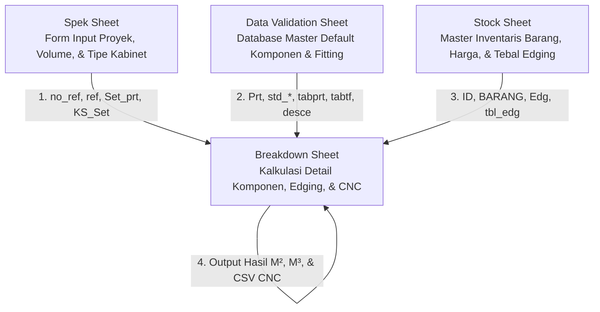

# Analisis Alur Rumus & Relasi Sheet (Row 14–198) · `master rekap 2026_Bom.xlsx`

Dokumen ini menyajikan bedah rumus secara mendalam untuk sheet **`Breakdown`** (khususnya baris 14–198) pada file `master rekap 2026_Bom.xlsx`. Sistem ini digunakan oleh drafter untuk melakukan breakdown kabinet secara otomatis berdasarkan spesifikasi yang diinput di sheet **`Spek`**.

---

## 1. Arsitektur Hubungan Antar Sheet

Sistem ini didesain sebagai aplikasi spreadsheet relasional yang memisahkan antara **input proyek**, **database master komponen**, **inventarisasi fisik (stock)**, dan **lembar kalkulasi (breakdown)**.



### Penjelasan Hubungan:
1. **`Spek` (Form Spesifikasi Proyek)**: Drafter memasukkan daftar kabinet aktif, ukuran utama, opsi bahan, dan kuantitas kabinet. Sheet `Breakdown` mengambil referensi kode kabinet dan jumlah kabinet dari sini menggunakan range dinamis (`ref`, `no_ref`).
2. **`Data Validation` (Database Master Part & Finish)**: Menyimpan semua parameter default untuk setiap jenis komponen (misal: *Pintu Kaca*, *Back Panel Rangka*). Default ini mencakup material, ketebalan bahan, konfigurasi edging di 4 sisi (biner), kode finishing, dan kuantitas hardware default.
3. **`stock` (Master Inventory & Logistik)**: Menyimpan semua ID fisik material, daftar kode edging, dan ketebalan material edging. Digunakan untuk mencocokkan ID komponen (`ID`, `BARANG`) dan mengambil ketebalan edging aktual (`tbl_edg`, `Edg`).
4. **`Breakdown` (Core Processor)**: Menggabungkan semua referensi di atas untuk menghitung ukuran aktual, kebutuhan bahan dasar, keliling edging, luas (M²), volume (M³), kebutuhan hardware total, hingga format baris CSV untuk diekspor langsung ke mesin CNC.

---

## 2. Struktur Baris & Tipe Row (Kolom C)

Di dalam sheet `Breakdown` baris 14–198, perilaku rumus dikontrol sepenuhnya oleh **Tipe Baris** di Kolom C (`type`):
* **`Ref`** (Header Kabinet - misal Row 144, 169): Merepresentasikan satu unit kabinet utuh (mengambil kode kabinet dari sheet `Spek`). Menghitung hardware global seperti rel, engsel, atau siku joint.
* **`Set_up`** (Header Group Modul - misal Row 14, 21, 28, 34, 196): Pengelompokkan modul tertentu di dalam kabinet (misal: "Pintu Kaca S2"). Baris ini bertindak sebagai penampung ukuran utama sebelum dipotong/dikurangi untuk komponen individual.
* **`prt`** (Part/Panel - misal Row 15, 16, 197, 198): Panel individual yang akan dipotong. Di sinilah kalkulasi material, tebal lapisan luar/dalam, konfigurasi edging keliling, dan volume aktual dihitung secara rinci.

---

## 3. Diseksi Formula Per Kelompok Kolom

Berikut adalah bedah formula dari baris 14–198 yang dibagi berdasarkan kelompok fungsional kolom:

### 3.1 Identitas & Kategori (Kolom A–C)
* **Kolom A (`id`)**: Mencocokkan apakah komponen di kolom H terdaftar di sheet `stock` sebagai inventaris fisik.
  ```excel
  =IFERROR(INDEX((ID),MATCH(H197,BARANG,0)),"…")
  ```
  * *Relasi*: Menggunakan `ID` (`stock!$C$4:$C$2676`) dan `BARANG` (`stock!$D$4:$D$2304`). Menjamin keterlacakan kode barang ke sistem stock gudang.
* **Kolom B (`cat.`)**: Menentukan kategori komponen (misal: *pintu*, *Kc*, *kab*, *alu*).
  ```excel
  =IFERROR(INDEX((cprt),MATCH($H197,Prt,0)),"…")
  ```
  * *Relasi*: Mengambil default kategori dari database master `cprt` (`'Data Validation'!$A$8:$A$384`) berdasarkan nama komponen di kolom H.
* **Kolom C (`type`)**: Tipe baris (Ref / Set_up / prt), diinput manual oleh drafter atau template.

### 3.2 Kode Produksi & Kuantitas (Kolom D–G, P–Q)
* **Kolom D (`kode`)**: Mengidentifikasi kode klasifikasi part (misal: Kaca Solid `ks` / non KS).
  * Pada baris `Ref`:
    ```excel
    =(INDEX(KS_Set,MATCH($H169,Set_prt,0)))
    ```
    * *Relasi*: Menghubungkan langsung ke sheet `Spek` menggunakan range `KS_Set` (`Spek!$G$177:$G$426`) dan `Set_prt` (`Spek!$D$177:$D$426`) untuk mengambil status tipe kabinet yang sedang aktif.
  * Pada baris `prt`:
    ```excel
    =IFERROR(INDEX((KS),MATCH($H197,Prt,0)),"")
    ```
* **Kolom G (`No`)**: Mengambil indeks referensi nomor urut dari input modul drafter.
  ```excel
  =IFERROR(INDEX((no_ref),MATCH($H197,ref,0)),"...")
  ```
  * *Relasi*: Mencocokkan komponen ke baris referensi di sheet `Spek` via `no_ref` (`Spek!$E$177:$E$571`) dan `ref` (`Spek!$D$177:$D$571`).
* **Kolom Q (`Jml` / Qty Total)**: Mengalikan kuantitas sub-komponen dengan jumlah kabinet aktif.
  ```excel
  =+P197*Q196
  ```
  * *Alur*: Mengalikan kolom P (`Sub` kuantitas per set) dengan kolom Q baris di atasnya (setup/kabinet qty). Menghasilkan kuantitas produksi riil.

### 3.3 Dimensi Fisik Komponen (Kolom J–O)
Drafter tidak perlu menghitung manual ukuran kaca atau panel rangka. Rumus mengurangkan ukuran dasar secara otomatis:
* **Kolom J (`P` / Panjang)** & **Kolom L (`L` / Lebar)**:
  * Contoh pada part Pintu Kaca (`Row 197`):
    ```excel
    =+J196-trim-trim
    ```
    * *Penjelasan*: Panjang pintu kaca (`J197`) diambil dari panjang setup modul (`J196`) dikurangi dua kali nilai `trim` (`'Data Validation'!$D$1172`). Ini adalah toleransi gap/celah keliling pintu kabinet.
  * Contoh pada Kaca interior (`Row 198`):
    ```excel
    =+J197-1
    ```
    * *Penjelasan*: Ukuran kaca dalam diturunkan langsung 1 mm dari ukuran frame pintu kaca (`J197`) agar kaca bisa masuk dengan presisi ke alur profil aluminium.
* **Kolom N (`T` / Tebal Aktual)**:
  ```excel
  =+(S197+W197+Y197)
  ```
  * *Penjelasan*: Tebal total part adalah hasil penjumlahan Tebal Bahan Dasar (`S197`) + Tebal Lapisan Luar (`W197`) + Tebal Lapisan Dalam (`Y197`). Rumus ini sangat dinamis mengikuti jenis HPL/decosheet yang dipilih.

### 3.4 Bahan & Finishing Lapisan (Kolom R–Y, AW, AY)
* **Kolom R (`Bahan`) & Kolom S (`T Bahan`)**:
  ```excel
  =IFERROR(INDEX((std_bhn_prt),MATCH($H197,Prt,0)),"")
  =IFERROR(INDEX((std_Tbahan_prt),MATCH($H197,Prt,0)),"")
  ```
  * *Relasi*: Mengambil bahan dasar default (seperti *Ply*, *MDF*) beserta tebal nominalnya (misal *18mm*, *13.5mm*) dari Master DB `std_bhn_prt` dan `std_Tbahan_prt` di sheet `Data Validation`.
* **Kolom V (`Luar`) & Kolom X (`Dalam`)**:
  ```excel
  =IFERROR(INDEX((tf),MATCH(T197,ctf,0)),"")
  ```
  * *Relasi*: `T197` berisi nama finishing luar default. Kolom V mencocokkannya ke range `tf` (`'Data Validation'!$C$404:$C$415`) menggunakan kode `ctf` (`'Data Validation'!$A$404:$A$415`) untuk mendeteksi tipe finishing aktual (misal: *Aica*, *HB_41130*, *Polos*, *Duco*).
* **Kolom W (`T` / Tebal Luar) & Kolom Y (`T` / Tebal Dalam)**:
  ```excel
  =IFERROR(INDEX((tebal_lapisan),MATCH($V197,tf,0)),"")
  ```
  * *Relasi*: Mengambil ketebalan material pelapis (HPL umumnya 1mm, decosheet/polos 0mm) dari tabel `tebal_lapisan` (`'Data Validation'!$E$404:$E$415`).
* **Kolom AW (`V lap` / Kode Gabungan Finishing)**:
  ```excel
  =CONCATENATE(VLOOKUP($V197,tabtf,2,0),VLOOKUP($X197,tabtf,2,0))
  ```
  * *Penjelasan*: Mengambil kode numerik 1-digit dari masing-masing jenis finishing luar & dalam melalui tabel `tabtf` (`'Data Validation'!$C$404:$D$415`) dan menggabungkannya menjadi kode 2-digit (misal `"72"`).
* **Kolom AY (`Deskripsi lapisan`)**:
  ```excel
  =IFERROR(VLOOKUP(AW197,descf,2,0),"")
  ```
  * *Relasi*: Menerjemahkan kode gabungan 2-digit tadi ke deskripsi teks komposit (misal `"72"` diubah menjadi `"HB_41130+Aica"`) dengan lookup ke tabel `descf` (`'Data Validation'!$B$418:$C$503`).

### 3.5 Pengaturan & Deskripsi Edging (Kolom Z–AG, AX, AZ, BY–CB)
* **Kolom Z–AC (`P1`, `P2`, `L1`, `L2` / Indikator Edging)**:
  ```excel
  =INDEX((std_edg_P1_prt),MATCH($H197,Prt,0))
  ```
  * *Relasi*: Mengambil nilai biner `1` (ada edging) atau `0` (tanpa edging) untuk masing-masing dari 4 sisi panel dari named range `std_edg_P1_prt` (`'Data Validation'!$Y$8:$Y$384`) dst.
* **Kolom AD–AG (`P1 (edg)` s.d `L2 (edg)` / Nama Material Edging)**:
  ```excel
  =IF($B197="alu",(INDEX((Fr),MATCH(Z197,cfr,0))),INDEX((te),MATCH(Z197,cte,0)))
  ```
  * *Penjelasan*: Jika kategori baris (`$B197`) adalah `"alu"` (frame aluminium), rumus akan melookup profil aluminium di tabel `Fr`/`cfr`. Jika non-aluminium, rumus mengambil nama edging kayu/PVC di tabel `te`/`cte`.
  * **Tabel Pemetaan Kode Validated Resmi (Type Edge `te` / `cte`):**
    * **`11`** $\rightarrow$ `Edg_Décor_1723_B` (Baris 1)
    * **`3`** $\rightarrow$ `Edg_DSS_00206_SM` (Baris 2)
    * **`9`** $\rightarrow$ `Melanor` (Baris 3)
    * **`5`** $\rightarrow$ `Edg_EAP_5342_M0` / `Edg_EAP_1338_DO` (Baris 7 / 17)
    * **`22`** $\rightarrow$ `Edg_Decor_1723_B_(55x1)` (Baris 8)
    * **`4`** $\rightarrow$ `Edg_DSS_00206_SM_(45X1)` (Baris 9)
    * **`1`** $\rightarrow$ `Edg_EAW_5216D1` (Baris 12)
    * **`2`** $\rightarrow$ `Edg_EAW_5216_D1(44x1)` (Baris 13)
    * **`7`** $\rightarrow$ `Trim 21 S2/S4 Brown Doff ( Alm. 75181 ) P3` (Baris 14)
    * **`8`** $\rightarrow$ `Trim 22 S2/S4 Brown Doff ( Alm. 75270 ) P3` (Baris 15)
    * **`6`** $\rightarrow$ `ST-36 Brown Doff ( Alm. 2351 ) P3 P3` (Baris 16)
    * **`66`** $\rightarrow$ `Edg_Decor_2023_B` (Baris 18)
  * **Tabel Pemetaan Kode Validated Resmi (Aluminium `Fr` / `cfr`):**
    * **`1`** $\rightarrow$ `M-FRM Tutup Belakang Black Doff ( Alm. 75225 ) P3`
    * **`2`** $\rightarrow$ `M-FRM Body Black Doff ( Alm. 75226 ) P3`
    * **`3`** $\rightarrow$ `M-FRM-07 Black Doff ( Alm. 75355 ) P3`
    * **`4`** $\rightarrow$ `M-FRM-02 Black Doff ( Alm. 75227 ) P3`
    * **`5`** $\rightarrow$ `M-FRM-03 Brown Gloss ( Alm. 75229 ) P3`
    * **`6`** $\rightarrow$ `M-SHF-01/02 Brown Gloss ( Alm. 75109 ) P3`
    * **`0`** $\rightarrow$ `0x2a`
* **Kolom AX (`V edg` / Kode Gabungan Edging)**:
  ```excel
  =IF($B197="alu",(CONCATENATE(VLOOKUP($AD197,tabfr,2,0),...)),(CONCATENATE(VLOOKUP($AD197,tabte,2,0),...)))
  ```
  * *Penjelasan*: Menggabungkan kode 1-digit dari 4 sisi edging (AD-AG) menjadi kode 4-digit (misal `"4433"` yang berarti P1=Edg_EAW, P2=Edg_EAW, L1=Polos, L2=Polos).
* **Kolom AZ (`Deskripsi edging`)**:
  ```excel
  =IF($B197="alu",(VLOOKUP(AX197,descfr,2,0)),(VLOOKUP(AX197,desce,2,0)))
  ```
  * *Relasi*: Menerjemahkan kode gabungan 4-digit tadi menjadi deskripsi penempatan edging yang rapi (misal: `"Edg_EAW_5216D1_2sisi_pjg"`) melalui lookup ke tabel `desce` (`'Data Validation'!$B$543:$C$744`).
* **Kolom BY–CB (`T_P1` s.d `T_L2` / Tebal Fisik Edging aktual)**:
  ```excel
  =IFERROR(INDEX((tbl_edg),MATCH($AD197,Edg,0)),"")
  ```
  * *Relasi*: **Sangat Krusial!** Menghubungkan langsung ke sheet **`stock`** (`tbl_edg` -> `stock!$E$1933:$E$2302`) untuk mendapatkan ketebalan fisik edging dalam satuan mm (misal PVC = 2mm, Melanor = 0.5mm). Nilai tebal edging ini nantinya dikurangkan dari ukuran mentah kayu agar ukuran setelah jadi (wood + edging) tetap presisi sesuai ukuran bersih desain.

### 3.6 Hardware & Kebutuhan Bor (Kolom BD–BJ, BS–BV)
Perhitungan kuantitas fitting/aksesoris terintegrasi langsung di sini:
* **Kolom BI (`Engsel`)**:
  ```excel
  =IF($AO169=0,0,IF(J169<=fp,2,(ROUNDUP(J169/fp,0))))*Q169
  ```
  * *Logika*: Menghitung jumlah engsel secara otomatis berdasarkan tinggi pintu (`J169`) dibagi dengan konstanta jarak engsel `fp` (`'Data Validation'!$D$1190`, nilainya 800mm). Jika tinggi pintu <= 800mm butuh 2 engsel, selebihnya dibulatkan ke atas.
* **Kolom BS (`minifix @`) & Kolom BT (`dowel @`)**:
  ```excel
  =IF($BD169=0,0,IF($L169<150,2,((ROUNDUP($L169/fm,0)*2))))*$Q169
  ```
  * *Logika*: Menghitung lubang bor minifix & dowel per panel secara dinamis berdasarkan lebar panel (`L169`). Jika lebar sempit (<150mm) cukup 2 buah, jika lebar maka dibulatkan berdasarkan pembagi modul minifix `fm` (`'Data Validation'!$D$1191`, biasanya 32mm).

### 3.7 Dimensi Aktual, M², M³, & Harga (Kolom BK–BN, BO, BQ, BW–BX)
* **Kolom BK (`P aktual`) & Kolom BL (`L aktual`) (meter)**:
  ```excel
  =(($J197+tol_p)*$Q197)/1000
  ```
  * *Penjelasan*: Mengonversi milimeter ke meter dengan menambahkan nilai toleransi CNC `tol_p` (`'Data Validation'!$D$1196`, nilainya 40mm) untuk menghitung kuantitas bahan kotor (gross).
* **Kolom BO (`Bahan Dasar`)**:
  ```excel
  =CONCATENATE(R197,"_",S197)
  ```
  * *Output*: Gabungan nama bahan & tebal (misal `"Ply_13,5"` atau `"MG_Purewhite_5"`). Digunakan sebagai key utama untuk lookup logistik.
* **Kolom BQ (`Harga/panel`)**:
  ```excel
  =((J197*L197*Q197)/(2400*1200))+10%
  ```
  * *Kalkulasi*: Menghitung proporsi luas panel terhadap ukuran standar triplek lembaran (2400x1200 mm) ditambah faktor waste/margin sebesar 10% (+10%).
* **Kolom BW (`M²` / Luas Bersih)** & **Kolom BX (`M³` / Volume Bersih)**:
  ```excel
  =+((J197*L197)*Q197)/1000000
  =+((J197*L197*N197)*Q197)/1000000000
  ```
  * *Penjelasan*: Menghitung volume kubikasi bersih (netto) dalam m² dan m³. Luas M² diakumulasikan ke sheet **`rekap full`** untuk membuat rekapitulasi pembelian bahan baku proyek secara otomatis.

---

## 4. Ekspor File Produksi CNC (Kolom CF — `CSV Format`)

Salah satu fitur tercanggih dalam sheet ini adalah pembuatan instruksi format CSV secara langsung untuk diekspor ke mesin pemotong panel CNC otomatis.
* **Formula pada Kolom CF (`CSV Format`)**:
  ```excel
  =IF(F197=1,(CONCATENATE(J197,";",L197,";",Q197,";",BP197,";",N197,";",H197,";","-1",";",AF197,";",CA197,";",AG197,";",CB197,";",AD197,";",BY197,";",AE197,";",BZ197))," ")
  ```
* **Contoh Output Evaluasi (Row 198 - Kaca_)**:
  ```text
  1195;189;1;MG_Purewhite 5 Polos;5;Kaca_;-1; ;; ;; ;; ;
  ```

### Struktur Kolom pada CSV CNC:
1. `J197` (1195) : Panjang Mentah (mm)
2. `L197` (189) : Lebar Mentah (mm)
3. `Q197` (1) : Jumlah Produksi
4. `BP197` (MG_Purewhite 5 Polos) : Deskripsi Komposisi Bahan Dasar + Lapisan
5. `N197` (5) : Ketebalan Komposit Selesai (mm)
6. `H197` (Kaca_) : Nama Komponen Panel
7. `-1` : Flag opsi bahan aktif
8. `AF197` / `CA197` (empty) : Edging L1 & Ketebalannya
9. `AG197` / `CB197` (empty) : Edging L2 & Ketebalannya
10. `AD197` / `BY197` (empty) : Edging P1 & Ketebalannya
11. `AE197` / `BZ197` (empty) : Edging P2 & Ketebalannya

---

## 5. Ringkasan Kamus Defined Names Terkait

Berikut adalah rangkuman range penting yang digunakan sebagai jembatan data dalam formula di atas:

| Nama Defined | Alamat Range Aktual | Fungsi Utama |
| :--- | :--- | :--- |
| **`ref`** | `Spek!$D$177:$D$571` | Daftar kode referensi kabinet di sheet Spek |
| **`no_ref`** | `Spek!$E$177:$E$571` | Daftar kuantitas/volume kabinet di sheet Spek |
| **`Prt`** | `'Data Validation'!$C$8:$C$384` | List nama komponen master di DB |
| **`cprt`** | `'Data Validation'!$A$8:$A$384` | List kategori komponen (pintu, alu, Kc, dll) |
| **`KS`** | `'Data Validation'!$E$8:$E$384` | Klasifikasi kode produksi komponen |
| **`std_bhn_prt`** | `'Data Validation'!$I$8:$I$384` | Default bahan baku per part (Ply, MDF, dll) |
| **`std_Tbahan_prt`**| `'Data Validation'!$J$8:$J$384` | Default tebal bahan baku (6, 9, 12, 18, 24 mm) |
| **`std_edg_P1_prt`**| `'Data Validation'!$Y$8:$Y$384` | Biner status edging sisi Panjang-1 (0 atau 1) |
| **`tbl_edg`** | `stock!$E$1933:$E$2302` | Ketebalan edging fisik di master stock |
| **`Edg`** | `stock!$D$1933:$D$2302` | Nama material edging di master stock |
| **`BARANG`** | `stock!$D$4:$D$2304` | Nama barang inventaris gudang |
| **`ID`** | `stock!$C$4:$C$2676` | ID barcode barang inventaris |
| **`tol_p`** | `'Data Validation'!$D$1196` | Nilai toleransi CNC (Panjang) = 40 mm |
| **`trim`** | `'Data Validation'!$D$1172` | Toleransi pemotongan celah pintu |


---

## 6. Lengkap Kolom-by-Kolom Dictionary (Kolom A–CF)

Bagian ini memaparkan **seluruh** 84 kolom dari Kolom A hingga CF secara berurutan. Ini menjamin cakupan 100% dari semua rumus dan relasi logika yang digunakan drafter pada baris 14–198:

### Column A — `id`
* **Fungsi**: ID unik komponen di gudang stock — Mengecek ketersediaan komponen fisik di gudang menggunakan master database inventory.
* **Pola Rumus Aktif**:
  ```excel
  =IFERROR(INDEX((ID),MATCH(H[ROW],BARANG,0)),"…")
  ```
* **Contoh Nilai Terkalkulasi**: `…` atau `…`

---

### Column B — `cat.`
* **Fungsi**: Kategori komponen — Klasifikasi part (misal: pintu, laci, kab, alu, Kc) yang diambil otomatis dari Master DB Validation.
* **Pola Rumus Aktif**:
  ```excel
  =IFERROR(INDEX((cprt),MATCH($H[ROW],Prt,0)),"…")
  ```
* **Contoh Nilai Terkalkulasi**: `…` atau `pintu`

---

### Column C — `type`
* **Fungsi**: Tipe Row / Baris — Menentukan jenis baris (`Ref` untuk unit kabinet, `Set_up` untuk header modul, `prt` untuk komponen panel).
* **Tipe Kolom**: Manual Input (diisi oleh drafter) atau Kolom Statis/Kosong.
* **Contoh Nilai Terkalkulasi**: `Set_up` atau `prt`

---

### Column D — `kode`
* **Fungsi**: Klasifikasi Klas/Kode klas — Mengklasifikasi jenis komponen apakah Kaca Solid (ks) atau part biasa.
* **Pola Rumus Aktif**:
  ```excel
  =(INDEX(KS_Set,MATCH($H[ROW],Set_prt,0)))
  ```
  ```excel
  =IFERROR(INDEX((KS),MATCH($H[ROW],Prt,0)),"")
  ```
* **Contoh Nilai Terkalkulasi**: `[ks]` atau `KS`

---

### Column E — `Tpk`
* **Fungsi**: Tipologi Bahan (Tpk) — Dropdown tipologi detail bahan (misal A, B, A»).
* **Tipe Kolom**: Manual Input (diisi oleh drafter) atau Kolom Statis/Kosong.
* **Contoh Nilai Terkalkulasi**: `A` atau `A»`

---

### Column F — `Opt`
* **Fungsi**: Opsi Material (Opt) — Indikator opsi varian material (0 = standard, 1 = opsi kustom).
* **Pola Rumus Aktif**:
  ```excel
  =IFERROR(INDEX((opt),MATCH($H[ROW],Prt,0)),"")
  ```
* **Contoh Nilai Terkalkulasi**: `0` atau `1`

---

### Column G — `No`
* **Fungsi**: No. Indeks Referensi — Nomor urut modul yang dipetakan secara dinamis berdasarkan input di sheet Spek.
* **Pola Rumus Aktif**:
  ```excel
  =IFERROR(INDEX((no_ref),MATCH($H[ROW],ref,0)),"...")
  ```
* **Contoh Nilai Terkalkulasi**: `•` atau `...`

---

### Column H — `Komponen`
* **Fungsi**: Nama Komponen — Deskripsi nama bagian kabinet (diisi manual oleh drafter atau bersumber dari modul template).
* **Tipe Kolom**: Manual Input (diisi oleh drafter) atau Kolom Statis/Kosong.
* **Contoh Nilai Terkalkulasi**: `Back Panel Rangka (rakit tukang)` atau `Back Panel Rangka`

---

### Column I — `Proses Khusus`
* **Fungsi**: Proses Khusus — Keterangan pengerjaan khusus pada part tersebut (misal: alur LED, bevel, coak).
* **Tipe Kolom**: Manual Input (diisi oleh drafter) atau Kolom Statis/Kosong.
* **Contoh Nilai Terkalkulasi**: `(alur_M_led_Blk)` atau `(alur_M_led_Blk)`

---

### Column J — `P`
* **Fungsi**: Panjang (P) mentah (mm) — Kalkulasi panjang potongan panel kayu, aluminium, atau kaca. Seringkali menggunakan deduksi toleransi gap.
* **Pola Rumus Aktif**:
  ```excel
  =+(N144-J151-(2*Nat_FC)-2)/2
  ```
  ```excel
  =+J14
  ```
  ```excel
  =+J147-Tdm-(2*sl_tbl)
  ```
  ```excel
  =+J151-trim-trim
  ```
  ```excel
  =+J152-1
  ```
  ```excel
  =+J157+12+(2*sl_tbl)
  ```
  ```excel
  =+J157+N156+N156
  ```
  ```excel
  =+J160-trim-trim
  ```
  ```excel
  =+J161-1
  ```
  ```excel
  =+J166+12
  ```
  ```excel
  =+J166+N165+N165
  ```
  ```excel
  =+J172
  ```
  ```excel
  =+J172-tol
  ```
  ```excel
  =+J177
  ```
  ```excel
  =+J186
  ```
  ```excel
  =+J188-trim-trim
  ```
  ```excel
  =+J189-1
  ```
  ```excel
  =+J192-trim-trim
  ```
  ```excel
  =+J193-1
  ```
  ```excel
  =+J196-trim-trim
  ```
  ```excel
  =+J197-1
  ```
  ```excel
  =+J21
  ```
  ```excel
  =+J28
  ```
  ```excel
  =+J34
  ```
  ```excel
  =+J49
  ```
  ```excel
  =+J53
  ```
  ```excel
  =+J57
  ```
  ```excel
  =+J61
  ```
  ```excel
  =+J72
  ```
  ```excel
  =+J78-J79
  ```
  ```excel
  =+J83
  ```
  ```excel
  =+N169-11-50
  ```
  ```excel
  =+ROUNDDOWN(L14-N16-N16,0)
  ```
  ```excel
  =+ROUNDDOWN(L21-N23-N23,0)
  ```
  ```excel
  =+ROUNDDOWN(L28-N30-N30,0)
  ```
  ```excel
  =+ROUNDDOWN(L34-N36-N36,0)
  ```
  ```excel
  =1204+616+600
  ```
  ```excel
  =1204+616+600+20
  ```
  ```excel
  =1390+100
  ```
  ```excel
  =150+1068+100
  ```
  ```excel
  =20+1190
  ```
  ```excel
  =20+1190+30+500
  ```
  ```excel
  =20+1190+30+500+100
  ```
  ```excel
  =20+620+904+276+20+600-588
  ```
  ```excel
  =391-Tdm+30-N184
  ```
  ```excel
  =40+1004+904
  ```
  ```excel
  =40+1004+904+422
  ```
  ```excel
  =40+1004-19
  ```
  ```excel
  =522+1218+50
  ```
  ```excel
  =522+1218-19
  ```
  ```excel
  =620+904+896+20
  ```
  ```excel
  =696+9-22
  ```
  ```excel
  =760+100
  ```
  ```excel
  =895+5+1985+5
  ```
  ```excel
  =900+750
  ```
  ```excel
  =904+1004
  ```
  ```excel
  =D_tdm_50
  ```
  ```excel
  =J147
  ```
  ```excel
  =J172
  ```
  ```excel
  =N144
  ```
  ```excel
  =N144-22
  ```
  ```excel
  =N169
  ```
  ```excel
  =ROUNDDOWN((J144-N145-N146),0)
  ```
  ```excel
  =ROUNDDOWN((J169-N170-N171),0)
  ```
* **Contoh Nilai Terkalkulasi**: `2000` atau `2000`

---

### Column K — `x`
* **Fungsi**: Separator Teks "x" — Literal karakter pembatas visual "x".
* **Tipe Kolom**: Manual Input (diisi oleh drafter) atau Kolom Statis/Kosong.
* **Contoh Nilai Terkalkulasi**: `x` atau `x`

---

### Column L — `L`
* **Fungsi**: Lebar (L) mentah (mm) — Kalkulasi lebar potongan panel. Sering mewarisi lebar dari baris setup di atasnya.
* **Pola Rumus Aktif**:
  ```excel
  =+(J169/P[ROW])-nat-nat
  ```
  ```excel
  =+J144-nat-nat
  ```
  ```excel
  =+J151-70
  ```
  ```excel
  =+J156
  ```
  ```excel
  =+J156-2
  ```
  ```excel
  =+J160-50
  ```
  ```excel
  =+J165
  ```
  ```excel
  =+J165-2
  ```
  ```excel
  =+L14
  ```
  ```excel
  =+L151
  ```
  ```excel
  =+L152-1
  ```
  ```excel
  =+L161-1
  ```
  ```excel
  =+L165-10-N167
  ```
  ```excel
  =+L169
  ```
  ```excel
  =+L169-18
  ```
  ```excel
  =+L169-50
  ```
  ```excel
  =+L169-50-T_gola
  ```
  ```excel
  =+L172-25
  ```
  ```excel
  =+L175
  ```
  ```excel
  =+L177
  ```
  ```excel
  =+L179-3
  ```
  ```excel
  =+L186
  ```
  ```excel
  =+L189-1
  ```
  ```excel
  =+L193-1
  ```
  ```excel
  =+L197-1
  ```
  ```excel
  =+L21
  ```
  ```excel
  =+L28
  ```
  ```excel
  =+L34
  ```
  ```excel
  =+L49
  ```
  ```excel
  =+L53
  ```
  ```excel
  =+L57
  ```
  ```excel
  =+L61
  ```
  ```excel
  =+L72
  ```
  ```excel
  =+L78
  ```
  ```excel
  =+L83
  ```
  ```excel
  =+L88
  ```
  ```excel
  =+L94
  ```
  ```excel
  =+ROUNDDOWN(L156-10-N158,0)
  ```
  ```excel
  =+ROUNDDOWN(L66-N67,0)
  ```
  ```excel
  =+ROUNDDOWN(L67-N68,0)
  ```
  ```excel
  =192-nat-nat
  ```
  ```excel
  =391-N184-2
  ```
  ```excel
  =410-nat-nat
  ```
  ```excel
  =560+25
  ```
  ```excel
  =580-20-350
  ```
  ```excel
  =600+25+105
  ```
  ```excel
  =600-12
  ```
  ```excel
  =680+25
  ```
  ```excel
  =680-20-350
  ```
  ```excel
  =700-12
  ```
  ```excel
  =960-6
  ```
  ```excel
  =J144-21
  ```
  ```excel
  =J169-21
  ```
  ```excel
  =L144
  ```
  ```excel
  =L151
  ```
  ```excel
  =L160
  ```
  ```excel
  =L188
  ```
  ```excel
  =L192
  ```
  ```excel
  =L196
  ```
  ```excel
  =ROUNDDOWN(N14-N15-tol,0)
  ```
  ```excel
  =ROUNDDOWN(N21-N22-tol,0)
  ```
  ```excel
  =ROUNDDOWN(N28-N29-tol,0)
  ```
  ```excel
  =ROUNDDOWN(N34-N35-tol,0)
  ```
  ```excel
  =ROUNDDOWN(N78-N79-tol,0)
  ```
  ```excel
  =ROUNDDOWN(N83-N84-tol,0)
  ```
* **Contoh Nilai Terkalkulasi**: `209` atau `209`

---

### Column M — `x`
* **Fungsi**: Separator Teks "x" — Literal karakter pembatas visual "x".
* **Tipe Kolom**: Manual Input (diisi oleh drafter) atau Kolom Statis/Kosong.
* **Contoh Nilai Terkalkulasi**: `x` atau `x`

---

### Column N — `T`
* **Fungsi**: Tebal Aktual Selesai (T) (mm) — Tebal komposit akhir panel, dihitung dari tebal bahan dasar + tebal lapisan luar + tebal lapisan dalam.
* **Pola Rumus Aktif**:
  ```excel
  =+(S[ROW]+W[ROW]+Y[ROW])
  ```
  ```excel
  =+L156
  ```
  ```excel
  =+L165
  ```
* **Contoh Nilai Terkalkulasi**: `75` atau `19`

---

### Column O — `Ukuran`
* **Fungsi**: Ukuran Gabungan (Teks) — Menggabungkan P x L x T menjadi satu baris teks ukuran bersih komponen untuk visualisasi.
* **Pola Rumus Aktif**:
  ```excel
  =CONCATENATE(J[ROW]," ",K[ROW]," ",L[ROW]," ",M[ROW]," ",N[ROW])
  ```
* **Contoh Nilai Terkalkulasi**: `2000 x 209 x 75` atau `2000 x 209 x 19`

---

### Column P — `Sub`
* **Fungsi**: Kuantitas Sub per set (Sub) — Jumlah komponen sejenis yang dibutuhkan untuk satu unit modul.
* **Pola Rumus Aktif**:
  ```excel
  =IFERROR(INDEX((std_sub_prt),MATCH($H[ROW],Prt,0)),"")
  ```
  ```excel
  =ROUNDUP((((2*J14)+(4*L14))/2440),0)
  ```
  ```excel
  =ROUNDUP((((2*J21)+(4*L21))/2440),0)
  ```
  ```excel
  =ROUNDUP((((2*J28)+(4*L28))/2440),0)
  ```
  ```excel
  =ROUNDUP((((2*J34)+(4*L34))/2440),0)
  ```
  ```excel
  =ROUNDUP((((2*J72)+(4*L72))/2440),0)
  ```
  ```excel
  =ROUNDUP((((2*J78)+(4*L78))/2440),0)
  ```
  ```excel
  =ROUNDUP((((2*J83)+(4*L83))/2440),0)
  ```
* **Contoh Nilai Terkalkulasi**: `1` atau `2`

---

### Column Q — `Jml`
* **Fungsi**: Kuantitas Produksi Total (Jml) — Jumlah total komponen yang harus diproduksi (Sub dikalikan volume kabinet dari sheet Spek).
* **Pola Rumus Aktif**:
  ```excel
  =+P[ROW]
  ```
  ```excel
  =+P[ROW]*Q14
  ```
  ```excel
  =+P[ROW]*Q144
  ```
  ```excel
  =+P[ROW]*Q151
  ```
  ```excel
  =+P[ROW]*Q155
  ```
  ```excel
  =+P[ROW]*Q160
  ```
  ```excel
  =+P[ROW]*Q164
  ```
  ```excel
  =+P[ROW]*Q169
  ```
  ```excel
  =+P[ROW]*Q183
  ```
  ```excel
  =+P[ROW]*Q188
  ```
  ```excel
  =+P[ROW]*Q192
  ```
  ```excel
  =+P[ROW]*Q196
  ```
  ```excel
  =+P[ROW]*Q21
  ```
  ```excel
  =+P[ROW]*Q28
  ```
  ```excel
  =+P[ROW]*Q34
  ```
  ```excel
  =+P[ROW]*Q49
  ```
  ```excel
  =+P[ROW]*Q53
  ```
  ```excel
  =+P[ROW]*Q57
  ```
  ```excel
  =+P[ROW]*Q61
  ```
  ```excel
  =+P[ROW]*Q66
  ```
  ```excel
  =+P[ROW]*Q72
  ```
  ```excel
  =+P[ROW]*Q78
  ```
  ```excel
  =+P[ROW]*Q83
  ```
  ```excel
  =+P[ROW]*Q88
  ```
  ```excel
  =+P[ROW]*Q94
  ```
  ```excel
  =P[ROW]*Q14
  ```
  ```excel
  =P[ROW]*Q144
  ```
  ```excel
  =P[ROW]*Q169
  ```
  ```excel
  =P[ROW]*Q21
  ```
  ```excel
  =P[ROW]*Q28
  ```
  ```excel
  =P[ROW]*Q34
  ```
  ```excel
  =P[ROW]*Q78
  ```
  ```excel
  =P[ROW]*Q83
  ```
* **Contoh Nilai Terkalkulasi**: `1` atau `1`

---

### Column R — `Bahan`
* **Fungsi**: Bahan Dasar — Jenis bahan dasar panel kayu (misal: Ply, MDF, PB) di-lookup otomatis dari Master DB Validation.
* **Pola Rumus Aktif**:
  ```excel
  =IFERROR(INDEX((std_bhn_prt),MATCH($H[ROW],Prt,0)),"")
  ```
* **Contoh Nilai Terkalkulasi**: `Ply` atau `Ply`

---

### Column S — `T Bahan`
* **Fungsi**: Ketebalan Bahan Dasar (mm) — Tebal nominal bahan baku panel (sebelum dilapisi) bersumber dari DB Validation.
* **Pola Rumus Aktif**:
  ```excel
  =IFERROR(INDEX((std_Tbahan_prt),MATCH($H[ROW],Prt,0)),"")
  ```
* **Contoh Nilai Terkalkulasi**: `18` atau `18`

---

### Column T — `L`
* **Fungsi**: Lapisan Luar Bawaan — Jenis pelapis eksterior bawaan komponen dari DB Validation.
* **Pola Rumus Aktif**:
  ```excel
  =INDEX((std_lapisan_luar_prt),MATCH($H[ROW],Prt,0))
  ```
* **Contoh Nilai Terkalkulasi**: `1` atau `0`

---

### Column U — `D`
* **Fungsi**: Lapisan Dalam Bawaan — Jenis pelapis interior bawaan komponen dari DB Validation.
* **Pola Rumus Aktif**:
  ```excel
  =INDEX((std_lapisan_dalam_prt),MATCH($H[ROW],Prt,0))
  ```
* **Contoh Nilai Terkalkulasi**: `0` atau `22`

---

### Column V — `Luar`
* **Fungsi**: Nama Lapisan Luar Aktif — Lapisan eksterior akhir yang terpilih setelah dicocokkan dengan finishing aktif proyek (misal: Aica, Duco).
* **Pola Rumus Aktif**:
  ```excel
  =IFERROR(INDEX((tf),MATCH(T[ROW],ctf,0)),"")
  ```
* **Contoh Nilai Terkalkulasi**: `WY_5216_D(V)` atau `Polos`

---

### Column W — `T`
* **Fungsi**: Ketebalan Lapisan Luar (mm) — Ketebalan material pelapis luar (di-lookup dari tabel tebal lapisan di sheet Data Validation).
* **Pola Rumus Aktif**:
  ```excel
  =IFERROR(INDEX((tebal_lapisan),MATCH($V[ROW],tf,0)),"")
  ```
* **Contoh Nilai Terkalkulasi**: `1` atau `0`

---

### Column X — `Dalam`
* **Fungsi**: Nama Lapisan Dalam Aktif — Lapisan interior akhir yang terpilih (misal: Polos, Melaminto, Aica HPL).
* **Pola Rumus Aktif**:
  ```excel
  =IFERROR(INDEX((tf),MATCH(U[ROW],ctf,0)),"")
  ```
* **Contoh Nilai Terkalkulasi**: `Polos` atau `Aica`

---

### Column Y — `T`
* **Fungsi**: Ketebalan Lapisan Dalam (mm) — Ketebalan material pelapis dalam (di-lookup dari database lapisan).
* **Pola Rumus Aktif**:
  ```excel
  =IFERROR(INDEX((tebal_lapisan),MATCH($X[ROW],tf,0)),"")
  ```
* **Contoh Nilai Terkalkulasi**: `0` atau `0.5`

---

### Column Z — `P1`
* **Fungsi**: Flag Edging Panjang-1 (P1) — Indikator biner (1 jika sisi Panjang-1 diberi edging, 0 jika polos).
* **Pola Rumus Aktif**:
  ```excel
  =INDEX((std_edg_P1_prt),MATCH($H[ROW],Prt,0))
  ```
* **Contoh Nilai Terkalkulasi**: `1` atau `0`

---

### Column AA — `P2`
* **Fungsi**: Flag Edging Panjang-2 (P2) — Indikator biner untuk sisi Panjang-2.
* **Pola Rumus Aktif**:
  ```excel
  =INDEX((std_edg_P2_prt),MATCH($H[ROW],Prt,0))
  ```
* **Contoh Nilai Terkalkulasi**: `1` atau `9`

---

### Column AB — `L1`
* **Fungsi**: Flag Edging Lebar-1 (L1) — Indikator biner untuk sisi Lebar-1.
* **Pola Rumus Aktif**:
  ```excel
  =INDEX((std_edg_L1_prt),MATCH($H[ROW],Prt,0))
  ```
* **Contoh Nilai Terkalkulasi**: `1` atau `0`

---

### Column AC — `L2`
* **Fungsi**: Flag Edging Lebar-2 (L2) — Indikator biner untuk sisi Lebar-2.
* **Pola Rumus Aktif**:
  ```excel
  =INDEX((std_edg_L2_prt),MATCH($H[ROW],Prt,0))
  ```
* **Contoh Nilai Terkalkulasi**: `1` atau `0`

---

### Column AD — `P1`
* **Fungsi**: Nama Edging Panjang-1 (P1 (edg)) — Nama profil edging atau aluminium profil yang digunakan pada sisi Panjang-1.
* **Pola Rumus Aktif**:
  ```excel
  =IF($B[ROW]="alu",(INDEX((Fr),MATCH(Z[ROW],cfr,0))),INDEX((te),MATCH(Z[ROW],cte,0)))
  ```
* **Contoh Nilai Terkalkulasi**: ` ` atau `Edg_EAW_5216D1`

---

### Column AE — `P2`
* **Fungsi**: Nama Edging Panjang-2 (P2 (edg)) — Nama profil edging pada sisi Panjang-2.
* **Pola Rumus Aktif**:
  ```excel
  =IF($B[ROW]="alu",(INDEX((Fr),MATCH(AA[ROW],cfr,0))),INDEX((te),MATCH(AA[ROW],cte,0)))
  ```
* **Contoh Nilai Terkalkulasi**: ` ` atau `Edg_EAW_5216D1`

---

### Column AF — `L1`
* **Fungsi**: Nama Edging Lebar-1 (L1 (edg)) — Nama profil edging pada sisi Lebar-1.
* **Pola Rumus Aktif**:
  ```excel
  =IF($B[ROW]="alu",(INDEX((Fr),MATCH(AB[ROW],cfr,0))),INDEX((te),MATCH(AB[ROW],cte,0)))
  ```
* **Contoh Nilai Terkalkulasi**: ` ` atau `Edg_EAW_5216D1`

---

### Column AG — `L2`
* **Fungsi**: Nama Edging Lebar-2 (L2 (edg)) — Nama profil edging pada sisi Lebar-2.
* **Pola Rumus Aktif**:
  ```excel
  =IF($B[ROW]="alu",(INDEX((Fr),MATCH(AC[ROW],cfr,0))),INDEX((te),MATCH(AC[ROW],cte,0)))
  ```
* **Contoh Nilai Terkalkulasi**: ` ` atau `Edg_EAW_5216D1`

---

### Column AH — `Profil 3`
* **Fungsi**: Kuantitas Profil 3 — Kebutuhan profil kustom tipe 3 per part.
* **Pola Rumus Aktif**:
  ```excel
  =IFERROR(INDEX((std_profil3_prt),MATCH($H[ROW],Prt,0)),"")
  ```
* **Contoh Nilai Terkalkulasi**: `0` atau `0`

---

### Column AI — `Profil 2`
* **Fungsi**: Kuantitas Profil 2 — Kebutuhan profil kustom tipe 2 per part.
* **Pola Rumus Aktif**:
  ```excel
  =IFERROR(INDEX((std_profil2_prt),MATCH($H[ROW],Prt,0)),"")
  ```
* **Contoh Nilai Terkalkulasi**: `0` atau `0`

---

### Column AJ — `Profil`
* **Fungsi**: Kuantitas Profil Standard — Kebutuhan profil standard per part.
* **Pola Rumus Aktif**:
  ```excel
  =IFERROR(INDEX((std_profil_prt),MATCH($H[ROW],Prt,0)),"")
  ```
* **Contoh Nilai Terkalkulasi**: `0` atau `0`

---

### Column AK — `Siku joint`
* **Fungsi**: Siku Joint (fitting) — Kebutuhan siku penyambung logam per part.
* **Pola Rumus Aktif**:
  ```excel
  =IFERROR(INDEX((std_siku_prt),MATCH($H[ROW],Prt,0)),"")
  ```
* **Contoh Nilai Terkalkulasi**: `0` atau `0`

---

### Column AL — `Screw Jf`
* **Fungsi**: Screw Joint Frame (fitting) — Jumlah sekrup khusus joint frame aluminium per part.
* **Pola Rumus Aktif**:
  ```excel
  =IFERROR(INDEX((std_screw_prt),MATCH($H[ROW],Prt,0)),"")
  ```
* **Contoh Nilai Terkalkulasi**: `0` atau `0`

---

### Column AM — `(Kosong/Tanpa Header)`
* **Fungsi**: Door Mechanism (Dormec) — Flag penentu penggunaan mekanisme pintu/gas spring.
* **Tipe Kolom**: Manual Input (diisi oleh drafter) atau Kolom Statis/Kosong.

---

### Column AN — `Rel`
* **Fungsi**: Rel Laci (fitting) — Indikator tipe rel laci yang digunakan.
* **Pola Rumus Aktif**:
  ```excel
  =IFERROR(INDEX((std_rel_prt),MATCH($H[ROW],Prt,0)),"")
  ```
* **Contoh Nilai Terkalkulasi**: `0` atau `0`

---

### Column AO — `Engsel`
* **Fungsi**: Engsel Pintu (fitting) — Indikator tipe engsel pintu.
* **Pola Rumus Aktif**:
  ```excel
  =IFERROR(INDEX((std_engsel_prt),MATCH($H[ROW],Prt,0)),"")
  ```
* **Contoh Nilai Terkalkulasi**: `0` atau `0`

---

### Column AP — `V`
* **Fungsi**: Batangan Vertikal 1 (V) — Kebutuhan aksesoris batangan vertikal kustom.
* **Pola Rumus Aktif**:
  ```excel
  =IFERROR(INDEX((std_anodizev_proses),MATCH($I[ROW],pk,0)),"")
  ```
* **Contoh Nilai Terkalkulasi**: `M-LED-02 Brown Doff ( Alm. 75111 ) P3` atau `M-LED-02 Brown Doff ( Alm. 75111 ) P3`

---

### Column AQ — `V2`
* **Fungsi**: Batangan Vertikal 2 (V2) — Kebutuhan aksesoris batangan vertikal tipe 2.
* **Pola Rumus Aktif**:
  ```excel
  =IFERROR(INDEX((std_anodizev2_proses),MATCH($I[ROW],pk,0)),"")
  ```
* **Contoh Nilai Terkalkulasi**: `0` atau `0`

---

### Column AR — `H`
* **Fungsi**: Batangan Horizontal (H) — Kebutuhan aksesoris batangan horizontal kustom.
* **Pola Rumus Aktif**:
  ```excel
  =IFERROR(INDEX((std_anodizeh_proses),MATCH($I[ROW],pk,0)),"")
  ```
  ```excel
  =edging1
  ```
* **Contoh Nilai Terkalkulasi**: `Edg_EAW_5216D1` atau `Edg_EAW_5216D1`

---

### Column AS — `Nama barang`
* **Fungsi**: Nama Barang Anodize — Jenis profil aluminium anodize atau fitting khusus yang dipasang.
* **Pola Rumus Aktif**:
  ```excel
  =IFERROR(INDEX((std_anodize_per_ukuran),MATCH($H[ROW],Prt,0)),"")
  ```
* **Contoh Nilai Terkalkulasi**: `0` atau `0`

---

### Column AT — `Panjang`
* **Fungsi**: Panjang Potongan Fitting (mm) — Kalkulasi panjang potongan aksesoris anodize/fitting secara dinamis berdasarkan ukuran panel.
* **Pola Rumus Aktif**:
  ```excel
  =IF($AS[ROW]=0,"",L[ROW])
  ```
  ```excel
  =IF($AS[ROW]=edging7,L[ROW],IF($AS[ROW]=edging8,L[ROW],IF($AS[ROW]=edging9,L[ROW],IF($AS[ROW]=Hand1,#REF!,IF($AS[ROW]=Hand2,#REF!,IF($AS[ROW]=hand3,"diisi manual",IF($AS[ROW]=hand4,"diisi manual",IF($AS[ROW]=hand5,"diisi manual",IF($AS[ROW]=mled02,J[ROW],IF($AS[ROW]=mprf1,J[ROW],IF($AS[ROW]=mlis1,J[ROW],"")))))))))))
  ```
  ```excel
  =IF($AS[ROW]=edging7,L[ROW],IF($AS[ROW]=edging8,L[ROW],IF($AS[ROW]=edging9,L[ROW],IF($AS[ROW]=Hand1,J100,IF($AS[ROW]=Hand2,L100,IF($AS[ROW]=hand3,"diisi manual",IF($AS[ROW]=hand4,"diisi manual",IF($AS[ROW]=hand5,"diisi manual",IF($AS[ROW]=mled02,J[ROW],IF($AS[ROW]=mprf1,J[ROW],IF($AS[ROW]=mlis1,J[ROW],"")))))))))))
  ```
  ```excel
  =IF($AS[ROW]=edging7,L[ROW],IF($AS[ROW]=edging8,L[ROW],IF($AS[ROW]=edging9,L[ROW],IF($AS[ROW]=Hand1,J101,IF($AS[ROW]=Hand2,L101,IF($AS[ROW]=hand3,"diisi manual",IF($AS[ROW]=hand4,"diisi manual",IF($AS[ROW]=hand5,"diisi manual",IF($AS[ROW]=mled02,J[ROW],IF($AS[ROW]=mprf1,J[ROW],IF($AS[ROW]=mlis1,J[ROW],"")))))))))))
  ```
  ```excel
  =IF($AS[ROW]=edging7,L[ROW],IF($AS[ROW]=edging8,L[ROW],IF($AS[ROW]=edging9,L[ROW],IF($AS[ROW]=Hand1,J103,IF($AS[ROW]=Hand2,L103,IF($AS[ROW]=hand3,"diisi manual",IF($AS[ROW]=hand4,"diisi manual",IF($AS[ROW]=hand5,"diisi manual",IF($AS[ROW]=mled02,J[ROW],IF($AS[ROW]=mprf1,J[ROW],IF($AS[ROW]=mlis1,J[ROW],"")))))))))))
  ```
  ```excel
  =IF($AS[ROW]=edging7,L[ROW],IF($AS[ROW]=edging8,L[ROW],IF($AS[ROW]=edging9,L[ROW],IF($AS[ROW]=Hand1,J104,IF($AS[ROW]=Hand2,L104,IF($AS[ROW]=hand3,"diisi manual",IF($AS[ROW]=hand4,"diisi manual",IF($AS[ROW]=hand5,"diisi manual",IF($AS[ROW]=mled02,J[ROW],IF($AS[ROW]=mprf1,J[ROW],IF($AS[ROW]=mlis1,J[ROW],"")))))))))))
  ```
  ```excel
  =IF($AS[ROW]=edging7,L[ROW],IF($AS[ROW]=edging8,L[ROW],IF($AS[ROW]=edging9,L[ROW],IF($AS[ROW]=Hand1,J105,IF($AS[ROW]=Hand2,L105,IF($AS[ROW]=hand3,"diisi manual",IF($AS[ROW]=hand4,"diisi manual",IF($AS[ROW]=hand5,"diisi manual",IF($AS[ROW]=mled02,J[ROW],IF($AS[ROW]=mprf1,J[ROW],IF($AS[ROW]=mlis1,J[ROW],"")))))))))))
  ```
  ```excel
  =IF($AS[ROW]=edging7,L[ROW],IF($AS[ROW]=edging8,L[ROW],IF($AS[ROW]=edging9,L[ROW],IF($AS[ROW]=Hand1,J108,IF($AS[ROW]=Hand2,L108,IF($AS[ROW]=hand3,"diisi manual",IF($AS[ROW]=hand4,"diisi manual",IF($AS[ROW]=hand5,"diisi manual",IF($AS[ROW]=mled02,J[ROW],IF($AS[ROW]=mprf1,J[ROW],IF($AS[ROW]=mlis1,J[ROW],"")))))))))))
  ```
  ```excel
  =IF($AS[ROW]=edging7,L[ROW],IF($AS[ROW]=edging8,L[ROW],IF($AS[ROW]=edging9,L[ROW],IF($AS[ROW]=Hand1,J109,IF($AS[ROW]=Hand2,L109,IF($AS[ROW]=hand3,"diisi manual",IF($AS[ROW]=hand4,"diisi manual",IF($AS[ROW]=hand5,"diisi manual",IF($AS[ROW]=mled02,J[ROW],IF($AS[ROW]=mprf1,J[ROW],IF($AS[ROW]=mlis1,J[ROW],"")))))))))))
  ```
  ```excel
  =IF($AS[ROW]=edging7,L[ROW],IF($AS[ROW]=edging8,L[ROW],IF($AS[ROW]=edging9,L[ROW],IF($AS[ROW]=Hand1,J111,IF($AS[ROW]=Hand2,L111,IF($AS[ROW]=hand3,"diisi manual",IF($AS[ROW]=hand4,"diisi manual",IF($AS[ROW]=hand5,"diisi manual",IF($AS[ROW]=mled02,J[ROW],IF($AS[ROW]=mprf1,J[ROW],IF($AS[ROW]=mlis1,J[ROW],"")))))))))))
  ```
  ```excel
  =IF($AS[ROW]=edging7,L[ROW],IF($AS[ROW]=edging8,L[ROW],IF($AS[ROW]=edging9,L[ROW],IF($AS[ROW]=Hand1,J112,IF($AS[ROW]=Hand2,L112,IF($AS[ROW]=hand3,"diisi manual",IF($AS[ROW]=hand4,"diisi manual",IF($AS[ROW]=hand5,"diisi manual",IF($AS[ROW]=mled02,J[ROW],IF($AS[ROW]=mprf1,J[ROW],IF($AS[ROW]=mlis1,J[ROW],"")))))))))))
  ```
  ```excel
  =IF($AS[ROW]=edging7,L[ROW],IF($AS[ROW]=edging8,L[ROW],IF($AS[ROW]=edging9,L[ROW],IF($AS[ROW]=Hand1,J113,IF($AS[ROW]=Hand2,L113,IF($AS[ROW]=hand3,"diisi manual",IF($AS[ROW]=hand4,"diisi manual",IF($AS[ROW]=hand5,"diisi manual",IF($AS[ROW]=mled02,J[ROW],IF($AS[ROW]=mprf1,J[ROW],IF($AS[ROW]=mlis1,J[ROW],"")))))))))))
  ```
  ```excel
  =IF($AS[ROW]=edging7,L[ROW],IF($AS[ROW]=edging8,L[ROW],IF($AS[ROW]=edging9,L[ROW],IF($AS[ROW]=Hand1,J116,IF($AS[ROW]=Hand2,L116,IF($AS[ROW]=hand3,"diisi manual",IF($AS[ROW]=hand4,"diisi manual",IF($AS[ROW]=hand5,"diisi manual",IF($AS[ROW]=mled02,J[ROW],IF($AS[ROW]=mprf1,J[ROW],IF($AS[ROW]=mlis1,J[ROW],"")))))))))))
  ```
  ```excel
  =IF($AS[ROW]=edging7,L[ROW],IF($AS[ROW]=edging8,L[ROW],IF($AS[ROW]=edging9,L[ROW],IF($AS[ROW]=Hand1,J117,IF($AS[ROW]=Hand2,L117,IF($AS[ROW]=hand3,"diisi manual",IF($AS[ROW]=hand4,"diisi manual",IF($AS[ROW]=hand5,"diisi manual",IF($AS[ROW]=mled02,J[ROW],IF($AS[ROW]=mprf1,J[ROW],IF($AS[ROW]=mlis1,J[ROW],"")))))))))))
  ```
  ```excel
  =IF($AS[ROW]=edging7,L[ROW],IF($AS[ROW]=edging8,L[ROW],IF($AS[ROW]=edging9,L[ROW],IF($AS[ROW]=Hand1,J119,IF($AS[ROW]=Hand2,L119,IF($AS[ROW]=hand3,"diisi manual",IF($AS[ROW]=hand4,"diisi manual",IF($AS[ROW]=hand5,"diisi manual",IF($AS[ROW]=mled02,J[ROW],IF($AS[ROW]=mprf1,J[ROW],IF($AS[ROW]=mlis1,J[ROW],"")))))))))))
  ```
  ```excel
  =IF($AS[ROW]=edging7,L[ROW],IF($AS[ROW]=edging8,L[ROW],IF($AS[ROW]=edging9,L[ROW],IF($AS[ROW]=Hand1,J120,IF($AS[ROW]=Hand2,L120,IF($AS[ROW]=hand3,"diisi manual",IF($AS[ROW]=hand4,"diisi manual",IF($AS[ROW]=hand5,"diisi manual",IF($AS[ROW]=mled02,J[ROW],IF($AS[ROW]=mprf1,J[ROW],IF($AS[ROW]=mlis1,J[ROW],"")))))))))))
  ```
  ```excel
  =IF($AS[ROW]=edging7,L[ROW],IF($AS[ROW]=edging8,L[ROW],IF($AS[ROW]=edging9,L[ROW],IF($AS[ROW]=Hand1,J122,IF($AS[ROW]=Hand2,L122,IF($AS[ROW]=hand3,"diisi manual",IF($AS[ROW]=hand4,"diisi manual",IF($AS[ROW]=hand5,"diisi manual",IF($AS[ROW]=mled02,J[ROW],IF($AS[ROW]=mprf1,J[ROW],IF($AS[ROW]=mlis1,J[ROW],"")))))))))))
  ```
  ```excel
  =IF($AS[ROW]=edging7,L[ROW],IF($AS[ROW]=edging8,L[ROW],IF($AS[ROW]=edging9,L[ROW],IF($AS[ROW]=Hand1,J123,IF($AS[ROW]=Hand2,L123,IF($AS[ROW]=hand3,"diisi manual",IF($AS[ROW]=hand4,"diisi manual",IF($AS[ROW]=hand5,"diisi manual",IF($AS[ROW]=mled02,J[ROW],IF($AS[ROW]=mprf1,J[ROW],IF($AS[ROW]=mlis1,J[ROW],"")))))))))))
  ```
  ```excel
  =IF($AS[ROW]=edging7,L[ROW],IF($AS[ROW]=edging8,L[ROW],IF($AS[ROW]=edging9,L[ROW],IF($AS[ROW]=Hand1,J126,IF($AS[ROW]=Hand2,L126,IF($AS[ROW]=hand3,"diisi manual",IF($AS[ROW]=hand4,"diisi manual",IF($AS[ROW]=hand5,"diisi manual",IF($AS[ROW]=mled02,J[ROW],IF($AS[ROW]=mprf1,J[ROW],IF($AS[ROW]=mlis1,J[ROW],"")))))))))))
  ```
  ```excel
  =IF($AS[ROW]=edging7,L[ROW],IF($AS[ROW]=edging8,L[ROW],IF($AS[ROW]=edging9,L[ROW],IF($AS[ROW]=Hand1,J127,IF($AS[ROW]=Hand2,L127,IF($AS[ROW]=hand3,"diisi manual",IF($AS[ROW]=hand4,"diisi manual",IF($AS[ROW]=hand5,"diisi manual",IF($AS[ROW]=mled02,J[ROW],IF($AS[ROW]=mprf1,J[ROW],IF($AS[ROW]=mlis1,J[ROW],"")))))))))))
  ```
  ```excel
  =IF($AS[ROW]=edging7,L[ROW],IF($AS[ROW]=edging8,L[ROW],IF($AS[ROW]=edging9,L[ROW],IF($AS[ROW]=Hand1,J130,IF($AS[ROW]=Hand2,L130,IF($AS[ROW]=hand3,"diisi manual",IF($AS[ROW]=hand4,"diisi manual",IF($AS[ROW]=hand5,"diisi manual",IF($AS[ROW]=mled02,J[ROW],IF($AS[ROW]=mprf1,J[ROW],IF($AS[ROW]=mlis1,J[ROW],"")))))))))))
  ```
  ```excel
  =IF($AS[ROW]=edging7,L[ROW],IF($AS[ROW]=edging8,L[ROW],IF($AS[ROW]=edging9,L[ROW],IF($AS[ROW]=Hand1,J131,IF($AS[ROW]=Hand2,L131,IF($AS[ROW]=hand3,"diisi manual",IF($AS[ROW]=hand4,"diisi manual",IF($AS[ROW]=hand5,"diisi manual",IF($AS[ROW]=mled02,J[ROW],IF($AS[ROW]=mprf1,J[ROW],IF($AS[ROW]=mlis1,J[ROW],"")))))))))))
  ```
  ```excel
  =IF($AS[ROW]=edging7,L[ROW],IF($AS[ROW]=edging8,L[ROW],IF($AS[ROW]=edging9,L[ROW],IF($AS[ROW]=Hand1,J132,IF($AS[ROW]=Hand2,L132,IF($AS[ROW]=hand3,"diisi manual",IF($AS[ROW]=hand4,"diisi manual",IF($AS[ROW]=hand5,"diisi manual",IF($AS[ROW]=mled02,J[ROW],IF($AS[ROW]=mprf1,J[ROW],IF($AS[ROW]=mlis1,J[ROW],"")))))))))))
  ```
  ```excel
  =IF($AS[ROW]=edging7,L[ROW],IF($AS[ROW]=edging8,L[ROW],IF($AS[ROW]=edging9,L[ROW],IF($AS[ROW]=Hand1,J135,IF($AS[ROW]=Hand2,L135,IF($AS[ROW]=hand3,"diisi manual",IF($AS[ROW]=hand4,"diisi manual",IF($AS[ROW]=hand5,"diisi manual",IF($AS[ROW]=mled02,J[ROW],IF($AS[ROW]=mprf1,J[ROW],IF($AS[ROW]=mlis1,J[ROW],"")))))))))))
  ```
  ```excel
  =IF($AS[ROW]=edging7,L[ROW],IF($AS[ROW]=edging8,L[ROW],IF($AS[ROW]=edging9,L[ROW],IF($AS[ROW]=Hand1,J137,IF($AS[ROW]=Hand2,L137,IF($AS[ROW]=hand3,"diisi manual",IF($AS[ROW]=hand4,"diisi manual",IF($AS[ROW]=hand5,"diisi manual",IF($AS[ROW]=mled02,J[ROW],IF($AS[ROW]=mprf1,J[ROW],IF($AS[ROW]=mlis1,J[ROW],"")))))))))))
  ```
  ```excel
  =IF($AS[ROW]=edging7,L[ROW],IF($AS[ROW]=edging8,L[ROW],IF($AS[ROW]=edging9,L[ROW],IF($AS[ROW]=Hand1,J139,IF($AS[ROW]=Hand2,L139,IF($AS[ROW]=hand3,"diisi manual",IF($AS[ROW]=hand4,"diisi manual",IF($AS[ROW]=hand5,"diisi manual",IF($AS[ROW]=mled02,J[ROW],IF($AS[ROW]=mprf1,J[ROW],IF($AS[ROW]=mlis1,J[ROW],"")))))))))))
  ```
  ```excel
  =IF($AS[ROW]=edging7,L[ROW],IF($AS[ROW]=edging8,L[ROW],IF($AS[ROW]=edging9,L[ROW],IF($AS[ROW]=Hand1,J14,IF($AS[ROW]=Hand2,L14,IF($AS[ROW]=hand3,"diisi manual",IF($AS[ROW]=hand4,"diisi manual",IF($AS[ROW]=hand5,"diisi manual",IF($AS[ROW]=mled02,J[ROW],IF($AS[ROW]=mprf1,J[ROW],IF($AS[ROW]=mlis1,J[ROW],"")))))))))))
  ```
  ```excel
  =IF($AS[ROW]=edging7,L[ROW],IF($AS[ROW]=edging8,L[ROW],IF($AS[ROW]=edging9,L[ROW],IF($AS[ROW]=Hand1,J141,IF($AS[ROW]=Hand2,L141,IF($AS[ROW]=hand3,"diisi manual",IF($AS[ROW]=hand4,"diisi manual",IF($AS[ROW]=hand5,"diisi manual",IF($AS[ROW]=mled02,J[ROW],IF($AS[ROW]=mprf1,J[ROW],IF($AS[ROW]=mlis1,J[ROW],"")))))))))))
  ```
  ```excel
  =IF($AS[ROW]=edging7,L[ROW],IF($AS[ROW]=edging8,L[ROW],IF($AS[ROW]=edging9,L[ROW],IF($AS[ROW]=Hand1,J144,IF($AS[ROW]=Hand2,L144,IF($AS[ROW]=hand3,"diisi manual",IF($AS[ROW]=hand4,"diisi manual",IF($AS[ROW]=hand5,"diisi manual",IF($AS[ROW]=mled02,J[ROW],IF($AS[ROW]=mprf1,J[ROW],IF($AS[ROW]=mlis1,J[ROW],"")))))))))))
  ```
  ```excel
  =IF($AS[ROW]=edging7,L[ROW],IF($AS[ROW]=edging8,L[ROW],IF($AS[ROW]=edging9,L[ROW],IF($AS[ROW]=Hand1,J145,IF($AS[ROW]=Hand2,L145,IF($AS[ROW]=hand3,"diisi manual",IF($AS[ROW]=hand4,"diisi manual",IF($AS[ROW]=hand5,"diisi manual",IF($AS[ROW]=mled02,J[ROW],IF($AS[ROW]=mprf1,J[ROW],IF($AS[ROW]=mlis1,J[ROW],"")))))))))))
  ```
  ```excel
  =IF($AS[ROW]=edging7,L[ROW],IF($AS[ROW]=edging8,L[ROW],IF($AS[ROW]=edging9,L[ROW],IF($AS[ROW]=Hand1,J146,IF($AS[ROW]=Hand2,L146,IF($AS[ROW]=hand3,"diisi manual",IF($AS[ROW]=hand4,"diisi manual",IF($AS[ROW]=hand5,"diisi manual",IF($AS[ROW]=mled02,J[ROW],IF($AS[ROW]=mprf1,J[ROW],IF($AS[ROW]=mlis1,J[ROW],"")))))))))))
  ```
  ```excel
  =IF($AS[ROW]=edging7,L[ROW],IF($AS[ROW]=edging8,L[ROW],IF($AS[ROW]=edging9,L[ROW],IF($AS[ROW]=Hand1,J147,IF($AS[ROW]=Hand2,L147,IF($AS[ROW]=hand3,"diisi manual",IF($AS[ROW]=hand4,"diisi manual",IF($AS[ROW]=hand5,"diisi manual",IF($AS[ROW]=mled02,J[ROW],IF($AS[ROW]=mprf1,J[ROW],IF($AS[ROW]=mlis1,J[ROW],"")))))))))))
  ```
  ```excel
  =IF($AS[ROW]=edging7,L[ROW],IF($AS[ROW]=edging8,L[ROW],IF($AS[ROW]=edging9,L[ROW],IF($AS[ROW]=Hand1,J148,IF($AS[ROW]=Hand2,L148,IF($AS[ROW]=hand3,"diisi manual",IF($AS[ROW]=hand4,"diisi manual",IF($AS[ROW]=hand5,"diisi manual",IF($AS[ROW]=mled02,J[ROW],IF($AS[ROW]=mprf1,J[ROW],IF($AS[ROW]=mlis1,J[ROW],"")))))))))))
  ```
  ```excel
  =IF($AS[ROW]=edging7,L[ROW],IF($AS[ROW]=edging8,L[ROW],IF($AS[ROW]=edging9,L[ROW],IF($AS[ROW]=Hand1,J15,IF($AS[ROW]=Hand2,L15,IF($AS[ROW]=hand3,"diisi manual",IF($AS[ROW]=hand4,"diisi manual",IF($AS[ROW]=hand5,"diisi manual",IF($AS[ROW]=mled02,J[ROW],IF($AS[ROW]=mprf1,J[ROW],IF($AS[ROW]=mlis1,J[ROW],"")))))))))))
  ```
  ```excel
  =IF($AS[ROW]=edging7,L[ROW],IF($AS[ROW]=edging8,L[ROW],IF($AS[ROW]=edging9,L[ROW],IF($AS[ROW]=Hand1,J151,IF($AS[ROW]=Hand2,L151,IF($AS[ROW]=hand3,"diisi manual",IF($AS[ROW]=hand4,"diisi manual",IF($AS[ROW]=hand5,"diisi manual",IF($AS[ROW]=mled02,J[ROW],IF($AS[ROW]=mprf1,J[ROW],IF($AS[ROW]=mlis1,J[ROW],"")))))))))))
  ```
  ```excel
  =IF($AS[ROW]=edging7,L[ROW],IF($AS[ROW]=edging8,L[ROW],IF($AS[ROW]=edging9,L[ROW],IF($AS[ROW]=Hand1,J152,IF($AS[ROW]=Hand2,L152,IF($AS[ROW]=hand3,"diisi manual",IF($AS[ROW]=hand4,"diisi manual",IF($AS[ROW]=hand5,"diisi manual",IF($AS[ROW]=mled02,J[ROW],IF($AS[ROW]=mprf1,J[ROW],IF($AS[ROW]=mlis1,J[ROW],"")))))))))))
  ```
  ```excel
  =IF($AS[ROW]=edging7,L[ROW],IF($AS[ROW]=edging8,L[ROW],IF($AS[ROW]=edging9,L[ROW],IF($AS[ROW]=Hand1,J155,IF($AS[ROW]=Hand2,L155,IF($AS[ROW]=hand3,"diisi manual",IF($AS[ROW]=hand4,"diisi manual",IF($AS[ROW]=hand5,"diisi manual",IF($AS[ROW]=mled02,J[ROW],IF($AS[ROW]=mprf1,J[ROW],IF($AS[ROW]=mlis1,J[ROW],"")))))))))))
  ```
  ```excel
  =IF($AS[ROW]=edging7,L[ROW],IF($AS[ROW]=edging8,L[ROW],IF($AS[ROW]=edging9,L[ROW],IF($AS[ROW]=Hand1,J156,IF($AS[ROW]=Hand2,L156,IF($AS[ROW]=hand3,"diisi manual",IF($AS[ROW]=hand4,"diisi manual",IF($AS[ROW]=hand5,"diisi manual",IF($AS[ROW]=mled02,J[ROW],IF($AS[ROW]=mprf1,J[ROW],IF($AS[ROW]=mlis1,J[ROW],"")))))))))))
  ```
  ```excel
  =IF($AS[ROW]=edging7,L[ROW],IF($AS[ROW]=edging8,L[ROW],IF($AS[ROW]=edging9,L[ROW],IF($AS[ROW]=Hand1,J157,IF($AS[ROW]=Hand2,L157,IF($AS[ROW]=hand3,"diisi manual",IF($AS[ROW]=hand4,"diisi manual",IF($AS[ROW]=hand5,"diisi manual",IF($AS[ROW]=mled02,J[ROW],IF($AS[ROW]=mprf1,J[ROW],IF($AS[ROW]=mlis1,J[ROW],"")))))))))))
  ```
  ```excel
  =IF($AS[ROW]=edging7,L[ROW],IF($AS[ROW]=edging8,L[ROW],IF($AS[ROW]=edging9,L[ROW],IF($AS[ROW]=Hand1,J160,IF($AS[ROW]=Hand2,L160,IF($AS[ROW]=hand3,"diisi manual",IF($AS[ROW]=hand4,"diisi manual",IF($AS[ROW]=hand5,"diisi manual",IF($AS[ROW]=mled02,J[ROW],IF($AS[ROW]=mprf1,J[ROW],IF($AS[ROW]=mlis1,J[ROW],"")))))))))))
  ```
  ```excel
  =IF($AS[ROW]=edging7,L[ROW],IF($AS[ROW]=edging8,L[ROW],IF($AS[ROW]=edging9,L[ROW],IF($AS[ROW]=Hand1,J161,IF($AS[ROW]=Hand2,L161,IF($AS[ROW]=hand3,"diisi manual",IF($AS[ROW]=hand4,"diisi manual",IF($AS[ROW]=hand5,"diisi manual",IF($AS[ROW]=mled02,J[ROW],IF($AS[ROW]=mprf1,J[ROW],IF($AS[ROW]=mlis1,J[ROW],"")))))))))))
  ```
  ```excel
  =IF($AS[ROW]=edging7,L[ROW],IF($AS[ROW]=edging8,L[ROW],IF($AS[ROW]=edging9,L[ROW],IF($AS[ROW]=Hand1,J164,IF($AS[ROW]=Hand2,L164,IF($AS[ROW]=hand3,"diisi manual",IF($AS[ROW]=hand4,"diisi manual",IF($AS[ROW]=hand5,"diisi manual",IF($AS[ROW]=mled02,J[ROW],IF($AS[ROW]=mprf1,J[ROW],IF($AS[ROW]=mlis1,J[ROW],"")))))))))))
  ```
  ```excel
  =IF($AS[ROW]=edging7,L[ROW],IF($AS[ROW]=edging8,L[ROW],IF($AS[ROW]=edging9,L[ROW],IF($AS[ROW]=Hand1,J165,IF($AS[ROW]=Hand2,L165,IF($AS[ROW]=hand3,"diisi manual",IF($AS[ROW]=hand4,"diisi manual",IF($AS[ROW]=hand5,"diisi manual",IF($AS[ROW]=mled02,J[ROW],IF($AS[ROW]=mprf1,J[ROW],IF($AS[ROW]=mlis1,J[ROW],"")))))))))))
  ```
  ```excel
  =IF($AS[ROW]=edging7,L[ROW],IF($AS[ROW]=edging8,L[ROW],IF($AS[ROW]=edging9,L[ROW],IF($AS[ROW]=Hand1,J166,IF($AS[ROW]=Hand2,L166,IF($AS[ROW]=hand3,"diisi manual",IF($AS[ROW]=hand4,"diisi manual",IF($AS[ROW]=hand5,"diisi manual",IF($AS[ROW]=mled02,J[ROW],IF($AS[ROW]=mprf1,J[ROW],IF($AS[ROW]=mlis1,J[ROW],"")))))))))))
  ```
  ```excel
  =IF($AS[ROW]=edging7,L[ROW],IF($AS[ROW]=edging8,L[ROW],IF($AS[ROW]=edging9,L[ROW],IF($AS[ROW]=Hand1,J169,IF($AS[ROW]=Hand2,L169,IF($AS[ROW]=hand3,"diisi manual",IF($AS[ROW]=hand4,"diisi manual",IF($AS[ROW]=hand5,"diisi manual",IF($AS[ROW]=mled02,J[ROW],IF($AS[ROW]=mprf1,J[ROW],IF($AS[ROW]=mlis1,J[ROW],"")))))))))))
  ```
  ```excel
  =IF($AS[ROW]=edging7,L[ROW],IF($AS[ROW]=edging8,L[ROW],IF($AS[ROW]=edging9,L[ROW],IF($AS[ROW]=Hand1,J17,IF($AS[ROW]=Hand2,L17,IF($AS[ROW]=hand3,"diisi manual",IF($AS[ROW]=hand4,"diisi manual",IF($AS[ROW]=hand5,"diisi manual",IF($AS[ROW]=mled02,J[ROW],IF($AS[ROW]=mprf1,J[ROW],IF($AS[ROW]=mlis1,J[ROW],"")))))))))))
  ```
  ```excel
  =IF($AS[ROW]=edging7,L[ROW],IF($AS[ROW]=edging8,L[ROW],IF($AS[ROW]=edging9,L[ROW],IF($AS[ROW]=Hand1,J170,IF($AS[ROW]=Hand2,L170,IF($AS[ROW]=hand3,"diisi manual",IF($AS[ROW]=hand4,"diisi manual",IF($AS[ROW]=hand5,"diisi manual",IF($AS[ROW]=mled02,J[ROW],IF($AS[ROW]=mprf1,J[ROW],IF($AS[ROW]=mlis1,J[ROW],"")))))))))))
  ```
  ```excel
  =IF($AS[ROW]=edging7,L[ROW],IF($AS[ROW]=edging8,L[ROW],IF($AS[ROW]=edging9,L[ROW],IF($AS[ROW]=Hand1,J171,IF($AS[ROW]=Hand2,L171,IF($AS[ROW]=hand3,"diisi manual",IF($AS[ROW]=hand4,"diisi manual",IF($AS[ROW]=hand5,"diisi manual",IF($AS[ROW]=mled02,J[ROW],IF($AS[ROW]=mprf1,J[ROW],IF($AS[ROW]=mlis1,J[ROW],"")))))))))))
  ```
  ```excel
  =IF($AS[ROW]=edging7,L[ROW],IF($AS[ROW]=edging8,L[ROW],IF($AS[ROW]=edging9,L[ROW],IF($AS[ROW]=Hand1,J172,IF($AS[ROW]=Hand2,L172,IF($AS[ROW]=hand3,"diisi manual",IF($AS[ROW]=hand4,"diisi manual",IF($AS[ROW]=hand5,"diisi manual",IF($AS[ROW]=mled02,J[ROW],IF($AS[ROW]=mprf1,J[ROW],IF($AS[ROW]=mlis1,J[ROW],"")))))))))))
  ```
  ```excel
  =IF($AS[ROW]=edging7,L[ROW],IF($AS[ROW]=edging8,L[ROW],IF($AS[ROW]=edging9,L[ROW],IF($AS[ROW]=Hand1,J173,IF($AS[ROW]=Hand2,L173,IF($AS[ROW]=hand3,"diisi manual",IF($AS[ROW]=hand4,"diisi manual",IF($AS[ROW]=hand5,"diisi manual",IF($AS[ROW]=mled02,J[ROW],IF($AS[ROW]=mprf1,J[ROW],IF($AS[ROW]=mlis1,J[ROW],"")))))))))))
  ```
  ```excel
  =IF($AS[ROW]=edging7,L[ROW],IF($AS[ROW]=edging8,L[ROW],IF($AS[ROW]=edging9,L[ROW],IF($AS[ROW]=Hand1,J174,IF($AS[ROW]=Hand2,L174,IF($AS[ROW]=hand3,"diisi manual",IF($AS[ROW]=hand4,"diisi manual",IF($AS[ROW]=hand5,"diisi manual",IF($AS[ROW]=mled02,J[ROW],IF($AS[ROW]=mprf1,J[ROW],IF($AS[ROW]=mlis1,J[ROW],"")))))))))))
  ```
  ```excel
  =IF($AS[ROW]=edging7,L[ROW],IF($AS[ROW]=edging8,L[ROW],IF($AS[ROW]=edging9,L[ROW],IF($AS[ROW]=Hand1,J175,IF($AS[ROW]=Hand2,L175,IF($AS[ROW]=hand3,"diisi manual",IF($AS[ROW]=hand4,"diisi manual",IF($AS[ROW]=hand5,"diisi manual",IF($AS[ROW]=mled02,J[ROW],IF($AS[ROW]=mprf1,J[ROW],IF($AS[ROW]=mlis1,J[ROW],"")))))))))))
  ```
  ```excel
  =IF($AS[ROW]=edging7,L[ROW],IF($AS[ROW]=edging8,L[ROW],IF($AS[ROW]=edging9,L[ROW],IF($AS[ROW]=Hand1,J176,IF($AS[ROW]=Hand2,L176,IF($AS[ROW]=hand3,"diisi manual",IF($AS[ROW]=hand4,"diisi manual",IF($AS[ROW]=hand5,"diisi manual",IF($AS[ROW]=mled02,J[ROW],IF($AS[ROW]=mprf1,J[ROW],IF($AS[ROW]=mlis1,J[ROW],"")))))))))))
  ```
  ```excel
  =IF($AS[ROW]=edging7,L[ROW],IF($AS[ROW]=edging8,L[ROW],IF($AS[ROW]=edging9,L[ROW],IF($AS[ROW]=Hand1,J177,IF($AS[ROW]=Hand2,L177,IF($AS[ROW]=hand3,"diisi manual",IF($AS[ROW]=hand4,"diisi manual",IF($AS[ROW]=hand5,"diisi manual",IF($AS[ROW]=mled02,J[ROW],IF($AS[ROW]=mprf1,J[ROW],IF($AS[ROW]=mlis1,J[ROW],"")))))))))))
  ```
  ```excel
  =IF($AS[ROW]=edging7,L[ROW],IF($AS[ROW]=edging8,L[ROW],IF($AS[ROW]=edging9,L[ROW],IF($AS[ROW]=Hand1,J178,IF($AS[ROW]=Hand2,L178,IF($AS[ROW]=hand3,"diisi manual",IF($AS[ROW]=hand4,"diisi manual",IF($AS[ROW]=hand5,"diisi manual",IF($AS[ROW]=mled02,J[ROW],IF($AS[ROW]=mprf1,J[ROW],IF($AS[ROW]=mlis1,J[ROW],"")))))))))))
  ```
  ```excel
  =IF($AS[ROW]=edging7,L[ROW],IF($AS[ROW]=edging8,L[ROW],IF($AS[ROW]=edging9,L[ROW],IF($AS[ROW]=Hand1,J179,IF($AS[ROW]=Hand2,L179,IF($AS[ROW]=hand3,"diisi manual",IF($AS[ROW]=hand4,"diisi manual",IF($AS[ROW]=hand5,"diisi manual",IF($AS[ROW]=mled02,J[ROW],IF($AS[ROW]=mprf1,J[ROW],IF($AS[ROW]=mlis1,J[ROW],"")))))))))))
  ```
  ```excel
  =IF($AS[ROW]=edging7,L[ROW],IF($AS[ROW]=edging8,L[ROW],IF($AS[ROW]=edging9,L[ROW],IF($AS[ROW]=Hand1,J180,IF($AS[ROW]=Hand2,L180,IF($AS[ROW]=hand3,"diisi manual",IF($AS[ROW]=hand4,"diisi manual",IF($AS[ROW]=hand5,"diisi manual",IF($AS[ROW]=mled02,J[ROW],IF($AS[ROW]=mprf1,J[ROW],IF($AS[ROW]=mlis1,J[ROW],"")))))))))))
  ```
  ```excel
  =IF($AS[ROW]=edging7,L[ROW],IF($AS[ROW]=edging8,L[ROW],IF($AS[ROW]=edging9,L[ROW],IF($AS[ROW]=Hand1,J182,IF($AS[ROW]=Hand2,L182,IF($AS[ROW]=hand3,"diisi manual",IF($AS[ROW]=hand4,"diisi manual",IF($AS[ROW]=hand5,"diisi manual",IF($AS[ROW]=mled02,J[ROW],IF($AS[ROW]=mprf1,J[ROW],IF($AS[ROW]=mlis1,J[ROW],"")))))))))))
  ```
  ```excel
  =IF($AS[ROW]=edging7,L[ROW],IF($AS[ROW]=edging8,L[ROW],IF($AS[ROW]=edging9,L[ROW],IF($AS[ROW]=Hand1,J184,IF($AS[ROW]=Hand2,L184,IF($AS[ROW]=hand3,"diisi manual",IF($AS[ROW]=hand4,"diisi manual",IF($AS[ROW]=hand5,"diisi manual",IF($AS[ROW]=mled02,J[ROW],IF($AS[ROW]=mprf1,J[ROW],IF($AS[ROW]=mlis1,J[ROW],"")))))))))))
  ```
  ```excel
  =IF($AS[ROW]=edging7,L[ROW],IF($AS[ROW]=edging8,L[ROW],IF($AS[ROW]=edging9,L[ROW],IF($AS[ROW]=Hand1,J185,IF($AS[ROW]=Hand2,L185,IF($AS[ROW]=hand3,"diisi manual",IF($AS[ROW]=hand4,"diisi manual",IF($AS[ROW]=hand5,"diisi manual",IF($AS[ROW]=mled02,J[ROW],IF($AS[ROW]=mprf1,J[ROW],IF($AS[ROW]=mlis1,J[ROW],"")))))))))))
  ```
  ```excel
  =IF($AS[ROW]=edging7,L[ROW],IF($AS[ROW]=edging8,L[ROW],IF($AS[ROW]=edging9,L[ROW],IF($AS[ROW]=Hand1,J188,IF($AS[ROW]=Hand2,L188,IF($AS[ROW]=hand3,"diisi manual",IF($AS[ROW]=hand4,"diisi manual",IF($AS[ROW]=hand5,"diisi manual",IF($AS[ROW]=mled02,J[ROW],IF($AS[ROW]=mprf1,J[ROW],IF($AS[ROW]=mlis1,J[ROW],"")))))))))))
  ```
  ```excel
  =IF($AS[ROW]=edging7,L[ROW],IF($AS[ROW]=edging8,L[ROW],IF($AS[ROW]=edging9,L[ROW],IF($AS[ROW]=Hand1,J189,IF($AS[ROW]=Hand2,L189,IF($AS[ROW]=hand3,"diisi manual",IF($AS[ROW]=hand4,"diisi manual",IF($AS[ROW]=hand5,"diisi manual",IF($AS[ROW]=mled02,J[ROW],IF($AS[ROW]=mprf1,J[ROW],IF($AS[ROW]=mlis1,J[ROW],"")))))))))))
  ```
  ```excel
  =IF($AS[ROW]=edging7,L[ROW],IF($AS[ROW]=edging8,L[ROW],IF($AS[ROW]=edging9,L[ROW],IF($AS[ROW]=Hand1,J192,IF($AS[ROW]=Hand2,L192,IF($AS[ROW]=hand3,"diisi manual",IF($AS[ROW]=hand4,"diisi manual",IF($AS[ROW]=hand5,"diisi manual",IF($AS[ROW]=mled02,J[ROW],IF($AS[ROW]=mprf1,J[ROW],IF($AS[ROW]=mlis1,J[ROW],"")))))))))))
  ```
  ```excel
  =IF($AS[ROW]=edging7,L[ROW],IF($AS[ROW]=edging8,L[ROW],IF($AS[ROW]=edging9,L[ROW],IF($AS[ROW]=Hand1,J196,IF($AS[ROW]=Hand2,L196,IF($AS[ROW]=hand3,"diisi manual",IF($AS[ROW]=hand4,"diisi manual",IF($AS[ROW]=hand5,"diisi manual",IF($AS[ROW]=mled02,J[ROW],IF($AS[ROW]=mprf1,J[ROW],IF($AS[ROW]=mlis1,J[ROW],"")))))))))))
  ```
  ```excel
  =IF($AS[ROW]=edging7,L[ROW],IF($AS[ROW]=edging8,L[ROW],IF($AS[ROW]=edging9,L[ROW],IF($AS[ROW]=Hand1,J21,IF($AS[ROW]=Hand2,L21,IF($AS[ROW]=hand3,"diisi manual",IF($AS[ROW]=hand4,"diisi manual",IF($AS[ROW]=hand5,"diisi manual",IF($AS[ROW]=mled02,J[ROW],IF($AS[ROW]=mprf1,J[ROW],IF($AS[ROW]=mlis1,J[ROW],"")))))))))))
  ```
  ```excel
  =IF($AS[ROW]=edging7,L[ROW],IF($AS[ROW]=edging8,L[ROW],IF($AS[ROW]=edging9,L[ROW],IF($AS[ROW]=Hand1,J22,IF($AS[ROW]=Hand2,L22,IF($AS[ROW]=hand3,"diisi manual",IF($AS[ROW]=hand4,"diisi manual",IF($AS[ROW]=hand5,"diisi manual",IF($AS[ROW]=mled02,J[ROW],IF($AS[ROW]=mprf1,J[ROW],IF($AS[ROW]=mlis1,J[ROW],"")))))))))))
  ```
  ```excel
  =IF($AS[ROW]=edging7,L[ROW],IF($AS[ROW]=edging8,L[ROW],IF($AS[ROW]=edging9,L[ROW],IF($AS[ROW]=Hand1,J24,IF($AS[ROW]=Hand2,L24,IF($AS[ROW]=hand3,"diisi manual",IF($AS[ROW]=hand4,"diisi manual",IF($AS[ROW]=hand5,"diisi manual",IF($AS[ROW]=mled02,J[ROW],IF($AS[ROW]=mprf1,J[ROW],IF($AS[ROW]=mlis1,J[ROW],"")))))))))))
  ```
  ```excel
  =IF($AS[ROW]=edging7,L[ROW],IF($AS[ROW]=edging8,L[ROW],IF($AS[ROW]=edging9,L[ROW],IF($AS[ROW]=Hand1,J28,IF($AS[ROW]=Hand2,L28,IF($AS[ROW]=hand3,"diisi manual",IF($AS[ROW]=hand4,"diisi manual",IF($AS[ROW]=hand5,"diisi manual",IF($AS[ROW]=mled02,J[ROW],IF($AS[ROW]=mprf1,J[ROW],IF($AS[ROW]=mlis1,J[ROW],"")))))))))))
  ```
  ```excel
  =IF($AS[ROW]=edging7,L[ROW],IF($AS[ROW]=edging8,L[ROW],IF($AS[ROW]=edging9,L[ROW],IF($AS[ROW]=Hand1,J29,IF($AS[ROW]=Hand2,L29,IF($AS[ROW]=hand3,"diisi manual",IF($AS[ROW]=hand4,"diisi manual",IF($AS[ROW]=hand5,"diisi manual",IF($AS[ROW]=mled02,J[ROW],IF($AS[ROW]=mprf1,J[ROW],IF($AS[ROW]=mlis1,J[ROW],"")))))))))))
  ```
  ```excel
  =IF($AS[ROW]=edging7,L[ROW],IF($AS[ROW]=edging8,L[ROW],IF($AS[ROW]=edging9,L[ROW],IF($AS[ROW]=Hand1,J31,IF($AS[ROW]=Hand2,L31,IF($AS[ROW]=hand3,"diisi manual",IF($AS[ROW]=hand4,"diisi manual",IF($AS[ROW]=hand5,"diisi manual",IF($AS[ROW]=mled02,J[ROW],IF($AS[ROW]=mprf1,J[ROW],IF($AS[ROW]=mlis1,J[ROW],"")))))))))))
  ```
  ```excel
  =IF($AS[ROW]=edging7,L[ROW],IF($AS[ROW]=edging8,L[ROW],IF($AS[ROW]=edging9,L[ROW],IF($AS[ROW]=Hand1,J34,IF($AS[ROW]=Hand2,L34,IF($AS[ROW]=hand3,"diisi manual",IF($AS[ROW]=hand4,"diisi manual",IF($AS[ROW]=hand5,"diisi manual",IF($AS[ROW]=mled02,J[ROW],IF($AS[ROW]=mprf1,J[ROW],IF($AS[ROW]=mlis1,J[ROW],"")))))))))))
  ```
  ```excel
  =IF($AS[ROW]=edging7,L[ROW],IF($AS[ROW]=edging8,L[ROW],IF($AS[ROW]=edging9,L[ROW],IF($AS[ROW]=Hand1,J35,IF($AS[ROW]=Hand2,L35,IF($AS[ROW]=hand3,"diisi manual",IF($AS[ROW]=hand4,"diisi manual",IF($AS[ROW]=hand5,"diisi manual",IF($AS[ROW]=mled02,J[ROW],IF($AS[ROW]=mprf1,J[ROW],IF($AS[ROW]=mlis1,J[ROW],"")))))))))))
  ```
  ```excel
  =IF($AS[ROW]=edging7,L[ROW],IF($AS[ROW]=edging8,L[ROW],IF($AS[ROW]=edging9,L[ROW],IF($AS[ROW]=Hand1,J37,IF($AS[ROW]=Hand2,L37,IF($AS[ROW]=hand3,"diisi manual",IF($AS[ROW]=hand4,"diisi manual",IF($AS[ROW]=hand5,"diisi manual",IF($AS[ROW]=mled02,J[ROW],IF($AS[ROW]=mprf1,J[ROW],IF($AS[ROW]=mlis1,J[ROW],"")))))))))))
  ```
  ```excel
  =IF($AS[ROW]=edging7,L[ROW],IF($AS[ROW]=edging8,L[ROW],IF($AS[ROW]=edging9,L[ROW],IF($AS[ROW]=Hand1,J41,IF($AS[ROW]=Hand2,L41,IF($AS[ROW]=hand3,"diisi manual",IF($AS[ROW]=hand4,"diisi manual",IF($AS[ROW]=hand5,"diisi manual",IF($AS[ROW]=mled02,J[ROW],IF($AS[ROW]=mprf1,J[ROW],IF($AS[ROW]=mlis1,J[ROW],"")))))))))))
  ```
  ```excel
  =IF($AS[ROW]=edging7,L[ROW],IF($AS[ROW]=edging8,L[ROW],IF($AS[ROW]=edging9,L[ROW],IF($AS[ROW]=Hand1,J42,IF($AS[ROW]=Hand2,L42,IF($AS[ROW]=hand3,"diisi manual",IF($AS[ROW]=hand4,"diisi manual",IF($AS[ROW]=hand5,"diisi manual",IF($AS[ROW]=mled02,J[ROW],IF($AS[ROW]=mprf1,J[ROW],IF($AS[ROW]=mlis1,J[ROW],"")))))))))))
  ```
  ```excel
  =IF($AS[ROW]=edging7,L[ROW],IF($AS[ROW]=edging8,L[ROW],IF($AS[ROW]=edging9,L[ROW],IF($AS[ROW]=Hand1,J44,IF($AS[ROW]=Hand2,L44,IF($AS[ROW]=hand3,"diisi manual",IF($AS[ROW]=hand4,"diisi manual",IF($AS[ROW]=hand5,"diisi manual",IF($AS[ROW]=mled02,J[ROW],IF($AS[ROW]=mprf1,J[ROW],IF($AS[ROW]=mlis1,J[ROW],"")))))))))))
  ```
  ```excel
  =IF($AS[ROW]=edging7,L[ROW],IF($AS[ROW]=edging8,L[ROW],IF($AS[ROW]=edging9,L[ROW],IF($AS[ROW]=Hand1,J45,IF($AS[ROW]=Hand2,L45,IF($AS[ROW]=hand3,"diisi manual",IF($AS[ROW]=hand4,"diisi manual",IF($AS[ROW]=hand5,"diisi manual",IF($AS[ROW]=mled02,J[ROW],IF($AS[ROW]=mprf1,J[ROW],IF($AS[ROW]=mlis1,J[ROW],"")))))))))))
  ```
  ```excel
  =IF($AS[ROW]=edging7,L[ROW],IF($AS[ROW]=edging8,L[ROW],IF($AS[ROW]=edging9,L[ROW],IF($AS[ROW]=Hand1,J49,IF($AS[ROW]=Hand2,L49,IF($AS[ROW]=hand3,"diisi manual",IF($AS[ROW]=hand4,"diisi manual",IF($AS[ROW]=hand5,"diisi manual",IF($AS[ROW]=mled02,J[ROW],IF($AS[ROW]=mprf1,J[ROW],IF($AS[ROW]=mlis1,J[ROW],"")))))))))))
  ```
  ```excel
  =IF($AS[ROW]=edging7,L[ROW],IF($AS[ROW]=edging8,L[ROW],IF($AS[ROW]=edging9,L[ROW],IF($AS[ROW]=Hand1,J50,IF($AS[ROW]=Hand2,L50,IF($AS[ROW]=hand3,"diisi manual",IF($AS[ROW]=hand4,"diisi manual",IF($AS[ROW]=hand5,"diisi manual",IF($AS[ROW]=mled02,J[ROW],IF($AS[ROW]=mprf1,J[ROW],IF($AS[ROW]=mlis1,J[ROW],"")))))))))))
  ```
  ```excel
  =IF($AS[ROW]=edging7,L[ROW],IF($AS[ROW]=edging8,L[ROW],IF($AS[ROW]=edging9,L[ROW],IF($AS[ROW]=Hand1,J53,IF($AS[ROW]=Hand2,L53,IF($AS[ROW]=hand3,"diisi manual",IF($AS[ROW]=hand4,"diisi manual",IF($AS[ROW]=hand5,"diisi manual",IF($AS[ROW]=mled02,J[ROW],IF($AS[ROW]=mprf1,J[ROW],IF($AS[ROW]=mlis1,J[ROW],"")))))))))))
  ```
  ```excel
  =IF($AS[ROW]=edging7,L[ROW],IF($AS[ROW]=edging8,L[ROW],IF($AS[ROW]=edging9,L[ROW],IF($AS[ROW]=Hand1,J54,IF($AS[ROW]=Hand2,L54,IF($AS[ROW]=hand3,"diisi manual",IF($AS[ROW]=hand4,"diisi manual",IF($AS[ROW]=hand5,"diisi manual",IF($AS[ROW]=mled02,J[ROW],IF($AS[ROW]=mprf1,J[ROW],IF($AS[ROW]=mlis1,J[ROW],"")))))))))))
  ```
  ```excel
  =IF($AS[ROW]=edging7,L[ROW],IF($AS[ROW]=edging8,L[ROW],IF($AS[ROW]=edging9,L[ROW],IF($AS[ROW]=Hand1,J57,IF($AS[ROW]=Hand2,L57,IF($AS[ROW]=hand3,"diisi manual",IF($AS[ROW]=hand4,"diisi manual",IF($AS[ROW]=hand5,"diisi manual",IF($AS[ROW]=mled02,J[ROW],IF($AS[ROW]=mprf1,J[ROW],IF($AS[ROW]=mlis1,J[ROW],"")))))))))))
  ```
  ```excel
  =IF($AS[ROW]=edging7,L[ROW],IF($AS[ROW]=edging8,L[ROW],IF($AS[ROW]=edging9,L[ROW],IF($AS[ROW]=Hand1,J58,IF($AS[ROW]=Hand2,L58,IF($AS[ROW]=hand3,"diisi manual",IF($AS[ROW]=hand4,"diisi manual",IF($AS[ROW]=hand5,"diisi manual",IF($AS[ROW]=mled02,J[ROW],IF($AS[ROW]=mprf1,J[ROW],IF($AS[ROW]=mlis1,J[ROW],"")))))))))))
  ```
  ```excel
  =IF($AS[ROW]=edging7,L[ROW],IF($AS[ROW]=edging8,L[ROW],IF($AS[ROW]=edging9,L[ROW],IF($AS[ROW]=Hand1,J61,IF($AS[ROW]=Hand2,L61,IF($AS[ROW]=hand3,"diisi manual",IF($AS[ROW]=hand4,"diisi manual",IF($AS[ROW]=hand5,"diisi manual",IF($AS[ROW]=mled02,J[ROW],IF($AS[ROW]=mprf1,J[ROW],IF($AS[ROW]=mlis1,J[ROW],"")))))))))))
  ```
  ```excel
  =IF($AS[ROW]=edging7,L[ROW],IF($AS[ROW]=edging8,L[ROW],IF($AS[ROW]=edging9,L[ROW],IF($AS[ROW]=Hand1,J62,IF($AS[ROW]=Hand2,L62,IF($AS[ROW]=hand3,"diisi manual",IF($AS[ROW]=hand4,"diisi manual",IF($AS[ROW]=hand5,"diisi manual",IF($AS[ROW]=mled02,J[ROW],IF($AS[ROW]=mprf1,J[ROW],IF($AS[ROW]=mlis1,J[ROW],"")))))))))))
  ```
  ```excel
  =IF($AS[ROW]=edging7,L[ROW],IF($AS[ROW]=edging8,L[ROW],IF($AS[ROW]=edging9,L[ROW],IF($AS[ROW]=Hand1,J66,IF($AS[ROW]=Hand2,L66,IF($AS[ROW]=hand3,"diisi manual",IF($AS[ROW]=hand4,"diisi manual",IF($AS[ROW]=hand5,"diisi manual",IF($AS[ROW]=mled02,J[ROW],IF($AS[ROW]=mprf1,J[ROW],IF($AS[ROW]=mlis1,J[ROW],"")))))))))))
  ```
  ```excel
  =IF($AS[ROW]=edging7,L[ROW],IF($AS[ROW]=edging8,L[ROW],IF($AS[ROW]=edging9,L[ROW],IF($AS[ROW]=Hand1,J67,IF($AS[ROW]=Hand2,L67,IF($AS[ROW]=hand3,"diisi manual",IF($AS[ROW]=hand4,"diisi manual",IF($AS[ROW]=hand5,"diisi manual",IF($AS[ROW]=mled02,J[ROW],IF($AS[ROW]=mprf1,J[ROW],IF($AS[ROW]=mlis1,J[ROW],"")))))))))))
  ```
  ```excel
  =IF($AS[ROW]=edging7,L[ROW],IF($AS[ROW]=edging8,L[ROW],IF($AS[ROW]=edging9,L[ROW],IF($AS[ROW]=Hand1,J68,IF($AS[ROW]=Hand2,L68,IF($AS[ROW]=hand3,"diisi manual",IF($AS[ROW]=hand4,"diisi manual",IF($AS[ROW]=hand5,"diisi manual",IF($AS[ROW]=mled02,J[ROW],IF($AS[ROW]=mprf1,J[ROW],IF($AS[ROW]=mlis1,J[ROW],"")))))))))))
  ```
  ```excel
  =IF($AS[ROW]=edging7,L[ROW],IF($AS[ROW]=edging8,L[ROW],IF($AS[ROW]=edging9,L[ROW],IF($AS[ROW]=Hand1,J72,IF($AS[ROW]=Hand2,L72,IF($AS[ROW]=hand3,"diisi manual",IF($AS[ROW]=hand4,"diisi manual",IF($AS[ROW]=hand5,"diisi manual",IF($AS[ROW]=mled02,J[ROW],IF($AS[ROW]=mprf1,J[ROW],IF($AS[ROW]=mlis1,J[ROW],"")))))))))))
  ```
  ```excel
  =IF($AS[ROW]=edging7,L[ROW],IF($AS[ROW]=edging8,L[ROW],IF($AS[ROW]=edging9,L[ROW],IF($AS[ROW]=Hand1,J73,IF($AS[ROW]=Hand2,L73,IF($AS[ROW]=hand3,"diisi manual",IF($AS[ROW]=hand4,"diisi manual",IF($AS[ROW]=hand5,"diisi manual",IF($AS[ROW]=mled02,J[ROW],IF($AS[ROW]=mprf1,J[ROW],IF($AS[ROW]=mlis1,J[ROW],"")))))))))))
  ```
  ```excel
  =IF($AS[ROW]=edging7,L[ROW],IF($AS[ROW]=edging8,L[ROW],IF($AS[ROW]=edging9,L[ROW],IF($AS[ROW]=Hand1,J78,IF($AS[ROW]=Hand2,L78,IF($AS[ROW]=hand3,"diisi manual",IF($AS[ROW]=hand4,"diisi manual",IF($AS[ROW]=hand5,"diisi manual",IF($AS[ROW]=mled02,J[ROW],IF($AS[ROW]=mprf1,J[ROW],IF($AS[ROW]=mlis1,J[ROW],"")))))))))))
  ```
  ```excel
  =IF($AS[ROW]=edging7,L[ROW],IF($AS[ROW]=edging8,L[ROW],IF($AS[ROW]=edging9,L[ROW],IF($AS[ROW]=Hand1,J79,IF($AS[ROW]=Hand2,L79,IF($AS[ROW]=hand3,"diisi manual",IF($AS[ROW]=hand4,"diisi manual",IF($AS[ROW]=hand5,"diisi manual",IF($AS[ROW]=mled02,J[ROW],IF($AS[ROW]=mprf1,J[ROW],IF($AS[ROW]=mlis1,J[ROW],"")))))))))))
  ```
  ```excel
  =IF($AS[ROW]=edging7,L[ROW],IF($AS[ROW]=edging8,L[ROW],IF($AS[ROW]=edging9,L[ROW],IF($AS[ROW]=Hand1,J88,IF($AS[ROW]=Hand2,L88,IF($AS[ROW]=hand3,"diisi manual",IF($AS[ROW]=hand4,"diisi manual",IF($AS[ROW]=hand5,"diisi manual",IF($AS[ROW]=mled02,J[ROW],IF($AS[ROW]=mprf1,J[ROW],IF($AS[ROW]=mlis1,J[ROW],"")))))))))))
  ```
  ```excel
  =IF($AS[ROW]=edging7,L[ROW],IF($AS[ROW]=edging8,L[ROW],IF($AS[ROW]=edging9,L[ROW],IF($AS[ROW]=Hand1,J89,IF($AS[ROW]=Hand2,L89,IF($AS[ROW]=hand3,"diisi manual",IF($AS[ROW]=hand4,"diisi manual",IF($AS[ROW]=hand5,"diisi manual",IF($AS[ROW]=mled02,J[ROW],IF($AS[ROW]=mprf1,J[ROW],IF($AS[ROW]=mlis1,J[ROW],"")))))))))))
  ```
  ```excel
  =IF($AS[ROW]=edging7,L[ROW],IF($AS[ROW]=edging8,L[ROW],IF($AS[ROW]=edging9,L[ROW],IF($AS[ROW]=Hand1,J90,IF($AS[ROW]=Hand2,L90,IF($AS[ROW]=hand3,"diisi manual",IF($AS[ROW]=hand4,"diisi manual",IF($AS[ROW]=hand5,"diisi manual",IF($AS[ROW]=mled02,J[ROW],IF($AS[ROW]=mprf1,J[ROW],IF($AS[ROW]=mlis1,J[ROW],"")))))))))))
  ```
  ```excel
  =IF($AS[ROW]=edging7,L[ROW],IF($AS[ROW]=edging8,L[ROW],IF($AS[ROW]=edging9,L[ROW],IF($AS[ROW]=Hand1,J91,IF($AS[ROW]=Hand2,L91,IF($AS[ROW]=hand3,"diisi manual",IF($AS[ROW]=hand4,"diisi manual",IF($AS[ROW]=hand5,"diisi manual",IF($AS[ROW]=mled02,J[ROW],IF($AS[ROW]=mprf1,J[ROW],IF($AS[ROW]=mlis1,J[ROW],"")))))))))))
  ```
  ```excel
  =IF($AS[ROW]=edging7,L[ROW],IF($AS[ROW]=edging8,L[ROW],IF($AS[ROW]=edging9,L[ROW],IF($AS[ROW]=Hand1,J94,IF($AS[ROW]=Hand2,L94,IF($AS[ROW]=hand3,"diisi manual",IF($AS[ROW]=hand4,"diisi manual",IF($AS[ROW]=hand5,"diisi manual",IF($AS[ROW]=mled02,J[ROW],IF($AS[ROW]=mprf1,J[ROW],IF($AS[ROW]=mlis1,J[ROW],"")))))))))))
  ```
  ```excel
  =IF($AS[ROW]=edging7,L[ROW],IF($AS[ROW]=edging8,L[ROW],IF($AS[ROW]=edging9,L[ROW],IF($AS[ROW]=Hand1,J95,IF($AS[ROW]=Hand2,L95,IF($AS[ROW]=hand3,"diisi manual",IF($AS[ROW]=hand4,"diisi manual",IF($AS[ROW]=hand5,"diisi manual",IF($AS[ROW]=mled02,J[ROW],IF($AS[ROW]=mprf1,J[ROW],IF($AS[ROW]=mlis1,J[ROW],"")))))))))))
  ```
  ```excel
  =IF($AS[ROW]=edging7,L[ROW],IF($AS[ROW]=edging8,L[ROW],IF($AS[ROW]=edging9,L[ROW],IF($AS[ROW]=Hand1,J96,IF($AS[ROW]=Hand2,L96,IF($AS[ROW]=hand3,"diisi manual",IF($AS[ROW]=hand4,"diisi manual",IF($AS[ROW]=hand5,"diisi manual",IF($AS[ROW]=mled02,J[ROW],IF($AS[ROW]=mprf1,J[ROW],IF($AS[ROW]=mlis1,J[ROW],"")))))))))))
  ```
  ```excel
  =IF($AS[ROW]=edging7,L[ROW],IF($AS[ROW]=edging8,L[ROW],IF($AS[ROW]=edging9,L[ROW],IF($AS[ROW]=Hand1,J97,IF($AS[ROW]=Hand2,L97,IF($AS[ROW]=hand3,"diisi manual",IF($AS[ROW]=hand4,"diisi manual",IF($AS[ROW]=hand5,"diisi manual",IF($AS[ROW]=mled02,J[ROW],IF($AS[ROW]=mprf1,J[ROW],IF($AS[ROW]=mlis1,J[ROW],"")))))))))))
  ```
* **Contoh Nilai Terkalkulasi**: `902` atau `902`

---

### Column AU — `Jumlah`
* **Fungsi**: Kuantitas Fitting Total — Kuantitas total aksesoris anodize yang dipotong (dikali volume produksi).
* **Pola Rumus Aktif**:
  ```excel
  =IF($AS[ROW]="","",Q[ROW]*BR[ROW])
  ```
  ```excel
  =IF($AS[ROW]=0,"",Q[ROW]*BR[ROW])
  ```
* **Contoh Nilai Terkalkulasi**: `0` atau `0`

---

### Column AV — `(Kosong/Tanpa Header)`
* **Fungsi**: Kolom Pemisah Kosong — Kolom kosong struktural pembatas.
* **Tipe Kolom**: Manual Input (diisi oleh drafter) atau Kolom Statis/Kosong.

---

### Column AW — `V lap`
* **Fungsi**: Kode Warna Gabungan (V lap) — Kode numerik 2-digit representasi kombinasi warna luar-dalam.
* **Pola Rumus Aktif**:
  ```excel
  =CONCATENATE(VLOOKUP($V[ROW],tabtf,2,0),VLOOKUP($X[ROW],tabtf,2,0))
  ```
* **Contoh Nilai Terkalkulasi**: `13` atau `37`

---

### Column AX — `V edg`
* **Fungsi**: Kode Edging Gabungan (V edg) — Kode numerik 4-digit representasi konfigurasi edging keliling.
* **Pola Rumus Aktif**:
  ```excel
  =IF($B[ROW]="alu",(CONCATENATE(VLOOKUP($AD[ROW],tabfr,2,0),VLOOKUP($AE[ROW],tabfr,2,0),VLOOKUP($AF[ROW],tabfr,2,0),VLOOKUP($AG[ROW],tabfr,2,0))),(CONCATENATE(VLOOKUP($AD[ROW],tabte,2,0),VLOOKUP($AE[ROW],tabte,2,0),VLOOKUP($AF[ROW],tabte,2,0),VLOOKUP($AG[ROW],tabte,2,0))))
  ```
* **Contoh Nilai Terkalkulasi**: `3333` atau `4444`

---

### Column AY — `Deskripsi lapisan`
* **Fungsi**: Deskripsi Lapisan Komposit — Deskripsi gabungan lapisan luar-dalam proyek (misal: Aica_1mk_Polos).
* **Pola Rumus Aktif**:
  ```excel
  =IFERROR(VLOOKUP(AW[ROW],descf,2,0),"")
  ```
* **Contoh Nilai Terkalkulasi**: `WY_5216_D(V)_1mk_Polos` atau `Aica_1mk_Polos`

---

### Column AZ — `Deskripsi edging`
* **Fungsi**: Deskripsi Edging Komposit — Deskripsi letak penempatan edging (misal: Edg_EAW_5216D1_Keliling).
* **Pola Rumus Aktif**:
  ```excel
  =IF($B[ROW]="alu",(VLOOKUP(AX[ROW],descfr,2,0)),(VLOOKUP(AX[ROW],desce,2,0)))
  ```
* **Contoh Nilai Terkalkulasi**: ` -` atau `Edg_EAW_5216D1_Keliling`

---

### Column BA — `Deskripsi Komponen`
* **Fungsi**: Deskripsi Ringkas Komponen — Teks pengenal ringkas gabungan no urut, nama part, dan lapisan.
* **Pola Rumus Aktif**:
  ```excel
  =IF($R[ROW]=0,CONCATENATE(0,")"," ",$H[ROW]," ",$J[ROW]),CONCATENATE(VLOOKUP(H[ROW],tabprt,2,0),")",$H[ROW]))
  ```
  ```excel
  =IF($R[ROW]=0,CONCATENATE(0,")"," ",$H[ROW]," ",$J[ROW]),CONCATENATE(VLOOKUP(H[ROW],tabprt,2,0),")",$H[ROW],"_",AY[ROW]))
  ```
* **Contoh Nilai Terkalkulasi**: `0) Back Panel Rangka (rakit tukang) 2000` atau `403)Back Panel Rangka_WY_5216_D(V)_1mk_Polos`

---

### Column BB — `Nama Komponen`
* **Fungsi**: Nama Komponen Lengkap — Teks komposit lengkap untuk label produksi (berisi no urut, bahan, ketebalan, lapisan, edging, dan proses khusus).
* **Pola Rumus Aktif**:
  ```excel
  =IF($B[ROW]="…",CONCATENATE(0,$E[ROW],")"," ",$H[ROW]),IF($B[ROW]="kc",CONCATENATE(VLOOKUP(H[ROW],tabprt,2,0),")",$H[ROW]," ",$R[ROW]," ",$S[ROW],"mm"," ","-"," "," ",";"," ",$AZ[ROW],"  ",$I[ROW]),IF($B[ROW]="alu",CONCATENATE(VLOOKUP(H[ROW],tabprt,2,0),")",$H[ROW]," ",$R[ROW]," ",$S[ROW],"mm"," ","-"," "," ",";"," ",$AZ[ROW],"  ",$I[ROW]),CONCATENATE(VLOOKUP(H[ROW],tabprt,2,0),")",$H[ROW]," ",$R[ROW]," ",$S[ROW],"mm"," ","-"," ",$AY[ROW]," ",";"," ",$AZ[ROW],"  ",$I[ROW]))))
  ```
* **Contoh Nilai Terkalkulasi**: `0A) Back Panel Rangka (rakit tukang)` atau `403)Back Panel Rangka Ply 18mm - WY_5216_D(V)_1mk_Polos ; Edg_EAW_5216D1_Keliling  `

---

### Column BC — `(Kosong/Tanpa Header)`
* **Fungsi**: Kolom Pemisah Kosong — Kolom pembatas visual.
* **Tipe Kolom**: Manual Input (diisi oleh drafter) atau Kolom Statis/Kosong.

---

### Column BD — `Minifix`
* **Fungsi**: Baut Minifix Bawaan — Kuantitas baut minifix default per part dari database master.
* **Pola Rumus Aktif**:
  ```excel
  =IFERROR(INDEX((std_minifix_prt),MATCH($H[ROW],Prt,0)),"")
  ```
* **Contoh Nilai Terkalkulasi**: `0` atau `0`

---

### Column BE — `Dowel`
* **Fungsi**: Dowel Kayu Bawaan — Kuantitas dowel kayu default per part dari database master.
* **Pola Rumus Aktif**:
  ```excel
  =IFERROR(INDEX((std_dowel_prt),MATCH($H[ROW],Prt,0)),"")
  ```
* **Contoh Nilai Terkalkulasi**: `0` atau `0`

---

### Column BF — ` @siku`
* **Fungsi**: Jumlah Siku per Panel — Jumlah siku penahan per panel.
* **Pola Rumus Aktif**:
  ```excel
  =IFERROR(INDEX((std_j_sikufr_prt),MATCH($H[ROW],Prt,0)),"")*Q[ROW]
  ```
* **Contoh Nilai Terkalkulasi**: `0` atau `0`

---

### Column BG — ` @ screw`
* **Fungsi**: Jumlah Screw per Panel — Jumlah sekrup penahan per panel.
* **Pola Rumus Aktif**:
  ```excel
  =IFERROR(INDEX((std_j_screwjf_prt),MATCH($H[ROW],Prt,0)),"")*Q[ROW]
  ```
* **Contoh Nilai Terkalkulasi**: `0` atau `0`

---

### Column BH — `Dormec`
* **Fungsi**: Kuantitas Dormec Aktif — Jumlah total mekanisme pintu aktif (terkoneksi kuantitas produksi).
* **Pola Rumus Aktif**:
  ```excel
  =IF($AM[ROW]=0,0,1)*Q[ROW]
  ```
* **Contoh Nilai Terkalkulasi**: `0` atau `0`

---

### Column BI — `Engsel`
* **Fungsi**: Kuantitas Engsel Aktif — Jumlah engsel aktif, dihitung otomatis berdasarkan tinggi pintu kabinet.
* **Pola Rumus Aktif**:
  ```excel
  =IF($AO[ROW]=0,0,IF(J[ROW]<=fp,2,(ROUNDUP(J[ROW]/fp,0))))*Q[ROW]
  ```
* **Contoh Nilai Terkalkulasi**: `0` atau `0`

---

### Column BJ — `Rel`
* **Fungsi**: Kuantitas Rel Laci Aktif — Jumlah total rel laci aktif (terkoneksi kuantitas produksi).
* **Pola Rumus Aktif**:
  ```excel
  =IF($AN[ROW]=0,0,1)*Q[ROW]
  ```
* **Contoh Nilai Terkalkulasi**: `0` atau `0`

---

### Column BK — `P`
* **Fungsi**: Panjang Kotor Aktual (m) — Konversi panjang panel mentah + toleransi pemotongan CNC ke satuan meter.
* **Pola Rumus Aktif**:
  ```excel
  =(($J[ROW]+tol_p)*$Q[ROW])/1000
  ```
* **Contoh Nilai Terkalkulasi**: `2.04` atau `2.04`

---

### Column BL — `L`
* **Fungsi**: Lebar Kotor Aktual (m) — Konversi lebar panel + toleransi CNC ke satuan meter.
* **Pola Rumus Aktif**:
  ```excel
  =(($L[ROW]+tol_p)*$Q[ROW])/1000
  ```
* **Contoh Nilai Terkalkulasi**: `0.249` atau `0.249`

---

### Column BM — `2(P+L)`
* **Fungsi**: Keliling Aktual Panel (2(P+L)) — Keliling panel dalam meter, digunakan untuk estimasi kebutuhan edging gulungan.
* **Pola Rumus Aktif**:
  ```excel
  =IF(R[ROW]=0,0,((2*((J[ROW]+tol_p)+(L[ROW]+tol_p))*Q[ROW])/1000))
  ```
* **Contoh Nilai Terkalkulasi**: `0` atau `4.578`

---

### Column BN — `(PxL)`
* **Fungsi**: Luas Aktual Panel (PxL) — Luas kotor panel per lembar dalam satuan meter persegi (M²).
* **Pola Rumus Aktif**:
  ```excel
  =((J[ROW]*L[ROW])/1000000)*Q[ROW]
  ```
* **Contoh Nilai Terkalkulasi**: `0.418` atau `0.2673`

---

### Column BO — `Bahan Dasar`
* **Fungsi**: Kode Bahan Dasar Logistik — Key logistik gabungan nama bahan & tebal (misal: Ply_18).
* **Pola Rumus Aktif**:
  ```excel
  =CONCATENATE(R[ROW],"_",S[ROW])
  ```
* **Contoh Nilai Terkalkulasi**: `_` atau `Ply_18`

---

### Column BP — `Deskripsi Bahan`
* **Fungsi**: Deskripsi Bahan Logistik — Deskripsi lengkap bahan dasar dan warna untuk pelacakan logistik.
* **Pola Rumus Aktif**:
  ```excel
  =CONCATENATE(R[ROW]," ",S[ROW]," ",AY[ROW])
  ```
* **Contoh Nilai Terkalkulasi**: `  ` atau `Ply 18 WY_5216_D(V)_1mk_Polos`

---

### Column BQ — `/panel`
* **Fungsi**: Proporsi Harga per Panel — Estimasi persentase harga panel triplek lembaran standar (waste +10%).
* **Pola Rumus Aktif**:
  ```excel
  =((J[ROW]*L[ROW]*Q[ROW])/(2400*1200))+10%
  ```
* **Contoh Nilai Terkalkulasi**: `0.2451388888888889` atau `0.2451388888888889`

---

### Column BR — `jumlah anodize @`
* **Fungsi**: Kuantitas Anodize per Panel — Kebutuhan profil anodize standar per panel.
* **Pola Rumus Aktif**:
  ```excel
  =IFERROR(INDEX((std_jml_anodize_per_uk),MATCH($H[ROW],Prt,0)),"")
  ```
* **Contoh Nilai Terkalkulasi**: `0` atau `0`

---

### Column BS — `minifix @`
* **Fungsi**: Total Minifix Proyek — Kalkulasi total minifix proyek, dihitung dinamis berdasarkan lebar panel.
* **Pola Rumus Aktif**:
  ```excel
  =IF($BD[ROW]=0,0,IF($L[ROW]<150,2,((ROUNDUP($L[ROW]/fm,0)*2))))*$Q[ROW]
  ```
* **Contoh Nilai Terkalkulasi**: `2` atau `0`

---

### Column BT — `dowel @`
* **Fungsi**: Total Dowel Proyek — Kalkulasi total dowel kayu proyek, dihitung dinamis berdasarkan lebar panel.
* **Pola Rumus Aktif**:
  ```excel
  =IF($BE[ROW]=0,0,IF($L[ROW]<150,2,((ROUNDUP($L[ROW]/fd,0)*2))))*$Q[ROW]
  ```
* **Contoh Nilai Terkalkulasi**: `4` atau `0`

---

### Column BU — `jml siku`
* **Fungsi**: Total Siku Proyek — Kalkulasi total siku proyek.
* **Pola Rumus Aktif**:
  ```excel
  =BF[ROW]*$Q[ROW]
  ```
* **Contoh Nilai Terkalkulasi**: `0` atau `0`

---

### Column BV — `jml screw`
* **Fungsi**: Total Sekrup Proyek — Kalkulasi total sekrup proyek.
* **Pola Rumus Aktif**:
  ```excel
  =BG[ROW]*$Q[ROW]
  ```
* **Contoh Nilai Terkalkulasi**: `0` atau `0`

---

### Column BW — `M²`
* **Fungsi**: Luas Bersih Total (M²) — Total luas bersih panel (luas lembar x kuantitas total) dalam meter persegi.
* **Pola Rumus Aktif**:
  ```excel
  =+((J[ROW]*L[ROW])*Q[ROW])/1000000
  ```
* **Contoh Nilai Terkalkulasi**: `0.418` atau `0.418`

---

### Column BX — `M³`
* **Fungsi**: Volume Bersih Total (M³) — Total volume bersih panel (luas x tebal x kuantitas) dalam meter kubik.
* **Pola Rumus Aktif**:
  ```excel
  =+((J[ROW]*L[ROW]*N[ROW])*Q[ROW])/1000000000
  ```
* **Contoh Nilai Terkalkulasi**: `0.03135` atau `0.007942`

---

### Column BY — `T_P1`
* **Fungsi**: Tebal Edging P1 (T_P1) (mm) — Ketebalan fisik edging Panjang-1 di-lookup langsung dari sheet stock (master edging).
* **Pola Rumus Aktif**:
  ```excel
  =IFERROR(INDEX((tbl_edg),MATCH($AD[ROW],Edg,0)),"")
  ```
* **Contoh Nilai Terkalkulasi**: `1` atau `1`

---

### Column BZ — `T_P2`
* **Fungsi**: Tebal Edging P2 (T_P2) (mm) — Ketebalan fisik edging Panjang-2 dari sheet stock.
* **Pola Rumus Aktif**:
  ```excel
  =IFERROR(INDEX((tbl_edg),MATCH($AE[ROW],Edg,0)),"")
  ```
* **Contoh Nilai Terkalkulasi**: `0.5` atau `0.5`

---

### Column CA — `T_L1`
* **Fungsi**: Tebal Edging L1 (T_L1) (mm) — Ketebalan fisik edging Lebar-1 dari sheet stock.
* **Pola Rumus Aktif**:
  ```excel
  =IFERROR(INDEX((tbl_edg),MATCH($AF[ROW],Edg,0)),"")
  ```
* **Contoh Nilai Terkalkulasi**: `1` atau `1`

---

### Column CB — `T_L2`
* **Fungsi**: Tebal Edging L2 (T_L2) (mm) — Ketebalan fisik edging Lebar-2 dari sheet stock.
* **Pola Rumus Aktif**:
  ```excel
  =IFERROR(INDEX((tbl_edg),MATCH($AG[ROW],Edg,0)),"")
  ```
* **Contoh Nilai Terkalkulasi**: `1` atau `1`

---

### Column CC — `P_cnc`
* **Fungsi**: Panjang Bersih CNC (P_cnc) (mm) — Panjang bersih panel kayu setelah dikurangi tebal edging L1 & L2 (panjang pemotongan gergaji CNC).
* **Pola Rumus Aktif**:
  ```excel
  =IFERROR((J[ROW]-CA[ROW]-CB[ROW]),"")
  ```
* **Contoh Nilai Terkalkulasi**: `898` atau `1988`

---

### Column CD — `L_cnc`
* **Fungsi**: Lebar Bersih CNC (L_cnc) (mm) — Lebar bersih panel kayu setelah dikurangi tebal edging P1 & P2.
* **Pola Rumus Aktif**:
  ```excel
  =IFERROR((L[ROW]-BY[ROW]-BZ[ROW]),"")
  ```
* **Contoh Nilai Terkalkulasi**: `128` atau `128`

---

### Column CE — `ukuran CNC`
* **Fungsi**: Ukuran CNC Gabungan (mm) — Teks komposit ukuran bersih pemotongan CNC untuk operator mesin.
* **Pola Rumus Aktif**:
  ```excel
  =IFERROR((CONCATENATE(CC[ROW]," ","x"," ",CD[ROW]," ","x"," ",N[ROW])),"")
  ```
* **Contoh Nilai Terkalkulasi**: ` x  x 75` atau ` x  x 19`

---

### Column CF — `CSV Format`
* **Fungsi**: Format CSV Ekspor CNC — Gabungan field semi-kolon (;) untuk ekspor data pemotongan panel ke mesin CNC secara massal.
* **Pola Rumus Aktif**:
  ```excel
  =IF(F[ROW]=1,(CONCATENATE(J[ROW],";",L[ROW],";",Q[ROW],";",BP[ROW],";",N[ROW],";",H[ROW],";","-1",";",AF[ROW],";",CA[ROW],";",AG[ROW],";",CB[ROW],";",AD[ROW],";",BY[ROW],";",AE[ROW],";",BZ[ROW]))," ")
  ```
* **Contoh Nilai Terkalkulasi**: ` ` atau ` `

---

## Pembaruan Desimal Lokalisasi Indonesia & Aturan Pembulatan

Untuk kolom kotor/keliling/luas/panel (Excel BG, BH, BI, BJ, BM):
1. **Pembulatan 1 Tempat Desimal (2 Digit Total)**: Dibulatkan ke desimal terdekat menggunakan `Math.round(val * 10) / 10` (misal: `2.444` $\rightarrow$ `2,4`, `0.640` $\rightarrow$ `0,6`).
2. **Pemisah Koma (Indonesia)**: Pemisah desimal diganti dari titik `.` menjadi koma `,` (seperti `0,9`, `1,8`, `6,2`, `1,4`, `0,6`).
3. **Pencetakan Integer Bersih**: Jika bernilai bilangan bulat (integer) atau nol, ditampilkan tanpa angka di belakang desimal (misal: `3.0` $\rightarrow$ `"3"`, `0` $\rightarrow$ `"0"`).
4. **Pembersihan Sel Kosong**: Untuk kolom area kotor `(PxL)` (`luas_gross`) dan `/panel` (`prop_harga`), jika nilainya `0` (seperti pada baris non-panel/hardware), sel dikosongkan sepenuhnya (`""`) agar tampilan grid bersih.
5. **Koreksi Formula CNC Swapped**:
   * `P_cnc` = `P - T_L1 - T_L2` (edging sisi L1 & L2 mengurangi panjang P)
   * `L_cnc` = `L - T_P1 - T_P2` (edging sisi P1 & P2 mengurangi lebar L)
   Dengan koreksi ini, panel ukuran `2404` dengan tebal edging `0,5` pada L1 dan L2 menghasilkan `2403` mm secara tepat (bukan `2402.5` mm akibat pertukaran).

---

## Relasi Dinamis Kategori `Type Edge` & `Type Finished` terhadap Isian `Spek`

Di dalam file Excel asli `master rekap 2026_Bom.xlsx`, tabel referensi dropdown di sheet `Data Validation` tidak bersifat statis, melainkan mengambil nilai secara dinamis dari isian spesifikasi yang dimasukkan drafter di sheet `Spek` (menggunakan rumus pranala langsung).

Berikut adalah pemetaan relasi lengkap masing-masing kode opsi kategori ke baris/cell di sheet `Spek Proyek`:

### 1. Relasi Kategori `Type Edge` (`te` / Range `Data Validation!C520:E534`)
Menyediakan daftar pilihan edging pelapis sisi tebal kayu. Nama opsi edging merupakan link/rumus ke isian di kolom D pada sheet `Spek`:

| Code (`Col A`) | Index (`Col D`) | Rumus Nama Edging (`Col C`) | Pranala Cell Spek | Fungsi / Keterangan |
| :---: | :---: | :--- | :---: | :--- |
| **11** | 1 | `=Spek!$D$43` | `Spek!D43` | Edging Kabinet 1 (`edgingkab1`) |
| **9** | 2 | `=Spek!$D$39` | `Spek!D39` | Tipe Edging untuk sisi tidak terlihat (`Melanor`) |
| **0** | 3 | (blank) | - | Polos / Tanpa Edging |
| **1** | 4 | `=Spek!$D$49` | `Spek!D49` | Edging Lapisan 1 (`edging1`) |
| **7** | 5 | `=Spek!D65` | `Spek!D65` | Edging Anodize `trim_21` |
| **8** | 6 | `=Spek!D66` | `Spek!D66` | Edging Anodize `trim_22` |
| **6** | 7 | `=Spek!D67` | `Spek!D67` | Edging Anodize `trim_38` (`ST-36`) |
| **-** | 8 | `=Spek!D68` | `Spek!D68` | Edging `M_grill` (`M-GRILL 01`) |
| **2** | 9 | `=Spek!$D$51` | `Spek!D51` | Edging Lapisan 2 (`edging2`) |
| **3** | 10 | `=Spek!D53` | `Spek!D53` | Edging Lapisan 3 (`edging3`) |
| **4** | 11 | `=Spek!D55` | `Spek!D55` | Edging Lapisan 4 (`edging4`) |
| **22** | 12 | `=Spek!$D$45` | `Spek!D45` | Edging Kabinet 2 (`edgingkab2`) |
| **5** | 13 | `=Spek!D57` | `Spek!D57` | Edging Lapisan 5 (`edging5`) |
| **33** | 14 | `=Spek!D47` | `Spek!D47` | Edging Kabinet 3 (`edgingkab3` / Kosong) |
| **66** | 15 | `=Spek!D59` | `Spek!D59` | Edging Lapisan 6 (`edging6`) |

---

### 2. Relasi Kategori `Type Finished` (`tf` / Range `Data Validation!C404:E415`)
Menyediakan daftar pilihan pelapis muka panel (HPL, kertas, duco, dll.). Nama opsi pelapis dan tebalnya merupakan link/rumus ke kolom D (Nama) dan kolom E (Tebal) pada sheet `Spek`:

| Code (`Col A`) | Index (`Col D`) | Rumus Nama HPL (`Col C`) | Rumus Tebal HPL (`Col E`) | Pranala Cell Spek (Nama / Tebal) | Fungsi / Keterangan |
| :---: | :---: | :--- | :--- | :--- | :--- |
| **1** | 1 | `=Spek!$D$48` | `=Spek!E48` | `Spek!D48` / `Spek!E48` | HPL Lapisan 1 (`lapisan1`) |
| **11** | 2 | `=Spek!$D$42` | `=Spek!E42` | `Spek!D42` / `Spek!E42` | HPL Kabinet 1 (`kabinet1`) |
| **0** | 3 | `Polos` | `0` | - / - | Polos / Tanpa Finishing |
| **2** | 4 | `=Spek!$D$50` | `=Spek!E50` | `Spek!D50` / `Spek!E50` | HPL Lapisan 2 (`lapisan2`) |
| **9** | 5 | `=Spek!$D$40` | `=Spek!$E$40` | `Spek!D40` / `Spek!E40` | Tipe Lapisan untuk sisi tidak terlihat (`[Aica]`) |
| **3** | 6 | `=Spek!$D$52` | `=Spek!E52` | `Spek!D52` / `Spek!E52` | HPL Lapisan 3 (`lapisan3`) |
| **22** | 7 | `=Spek!$D$44` | `=Spek!E44` | `Spek!D44` / `Spek!E44` | HPL Kabinet 2 (`kabinet2`) |
| **4** | 8 | `=Spek!$D$54` | `=Spek!E54` | `Spek!D54` / `Spek!E54` | HPL Lapisan 4 (`lapisan4`) |
| **5** | 9 | `=Spek!$D$56` | `=Spek!E56` | `Spek!D56` / `Spek!E56` | HPL Lapisan 5 (`lapisan5`) |
| **6** | 10 | `=Spek!$D$58` | `=Spek!E58` | `Spek!D58` / `Spek!E58` | HPL Lapisan 6 (`lapisan6` / Kosong) |
| **33** | 11 | `=Spek!$D$46` | `=Spek!E46` | `Spek!D46` / `Spek!E46` | HPL Kabinet 3 (`kabinet3`) |
| **7** | 12 | `=Spek!$D$60` | `=Spek!E60` | `Spek!D60` / `Spek!E60` | HPL Lapisan 7 (`lapisan7` / `Duco`) |

---

## 3. Implementasi Programatik pada Aplikasi Web (React & JS)
Untuk mereplikasi perilaku relasional dinamis dari Excel di atas ke dalam kode aplikasi, kami telah membangun sistem sinkronisasi dinamis pada modul frontend:

1. **Helper Sinkronisasi (`src/utils/categorySync.js`)**:
   Fungsi `syncCategoriesWithSpek(categories, spec, stock)` mengekstrak pemetaan alias (`lapisan1` s.d `lapisan7`, `kabinet1` s.d `kabinet3`, `edging1` s.d `edging6`, dll.) dari `buildAliasMap` proyek aktif.
   - **Type Finished (`tf`), `lap_luar`, & `lap_dalam`**: Setiap kali isian di Spek diperbarui, item dalam kategori ini akan berubah nama (`name`) mengikuti Spek dan memperbarui tebal pelapis (`tebal`) secara otomatis via `getFinishingThickness(specVal)`.
   - **Type Edge (`te`) & `edg`**: Setiap kali isian di Spek diperbarui, item dalam kategori ini akan berubah nama mengikuti Spek dan mencocokkan tebal edging (`tebal`) secara dinamis dengan database stok fisik (`stock`) via `getEdgingThickness(specVal, stock)`.

2. **Integrasi Komponen (`src/components/ProjectPage.js`)**:
   Menerapkan sinkronisasi dinamis berbasis React memoization:
   ```javascript
   const syncedCategories = React.useMemo(() => {
     return syncCategoriesWithSpek(categories, activeSpec, stock);
   }, [categories, activeSpec, stock]);
   ```
   Variabel `syncedCategories` ini kemudian di-inject ke dalam objek `activeSpecWithGC` (yang digunakan oleh mesin perhitungan formula `breakdownCalc.js`) serta disalurkan ke `<SpekPage>`, `<BreakdownPage>`, dan visual grid `<CategoryRefPage>`, menjamin keterhubungan real-time 100% antara isian Form Spek dengan dropdown dan perhitungan tebal aktual/CNC di Breakdown.

3. **Editable KODE Lapisan Standard & Lookup Kategori 'tf' Dinamis (`src/components/SpekPage.js`)**:
   Untuk memperbolehkan drafter mengkustomisasi lapisan standard (seperti `lap_blk_pintu`, `lap_inv_kab`, `lap_pintu_mlp`, `tip_lap_inv`):
   - Kolom **KODE** pada section **Lapisan Standard** dirender sebagai `<input type="text" />` yang editable (bukannya teks statis read-only).
   - Ketika kode lapisan standard diedit (misal dari `11` ke `22`):
     - Sistem memicu fungsi `handleStandardKodeChange` untuk menyimpan kode baru di `localKodes`.
     - Melakukan pencarian dinamis (lookup) nama HPL/finishing dari kategori `tf` berdasarkan kode tersebut via `lookupCat(syncedCategories, 'tf', newKode)`.
     - Memperbarui `localVals` dengan nama HPL yang cocok (atau kosong jika tidak ditemukan).
     - Otomatis menonaktifkan logika override otomatis bawaan jika terdapat input kode kustom (tidak kosong).
     - Menampilkan ketebalan HPL baru secara otomatis pada kolom tebal di Spek.
     - Jika input kode kustom dikosongkan (clear), sistem otomatis mengembalikan baris tersebut ke formula / nilai kalkulasi standard bawaan (computed fallback).
   - **Real-Time Category Sync**:
     - Ditambahkan React `useEffect` hook yang memantau perubahan `categories` (yaitu `syncedCategories`).
     - Jika pengguna mengubah isian HPL pada "Spesifikasi Lapisan" (misal mengubah `kabinet2` yang berkode `22` dari `[Aica]` ke `Duco`), sistem otomatis melakukan re-lookup kode standard layer secara realtime, sehingga nilai lapisan standard berkode `22` langsung ikut terupdate menjadi `Duco`.

---

## Catatan Bug Fixes & Penyempurnaan Engine (Update Juni 2026)

### 1. `rowsWithParent` — Penyediaan Context Baris untuk Formula Referensi
Formula referensi sel (seperti `=I1`, `=J1`, `=K1`) menunjuk ke indeks baris di dalam array data. Di UI (`SharedModuleTable.js`), prop `items` hanya berisi baris-baris anak (tanpa baris parent/setup). Akibatnya, referensi baris bergeser atau tidak terbaca.
* **Solusi**: Selalu bungkus array baris dalam context wrapper `rowsWithParent` (`[parent, ...items]`) sebelum memanggil `calcBreakdownItem` atau `evaluateFormula`, memastikan baris ke-0 (parent) selalu ada sebagai acuan pencarian referensi sel.

### 2. `isFinishingEmpty` — Semantik Nilai Kosong vs Nol (0)
Pada kolom finishing seperti `l_fin` (Face L) atau `d_fin` (Face D), kode `0` merepresentasikan **Polos** (finishing valid yang ada di kategori `tf`), sedangkan yang bernilai kosong (`""` atau `"-"`) atau tidak ditemukan di kategori barulah dianggap kosong/tidak terdefinisi.
* **Solusi**: Mengganti pengecekan falsy (`!code`) menjadi `isFinishingEmpty(code)` yang hanya menganggap kosong jika nilai bernilai `null`, `undefined`, `""`, atau `"-"`. Nilai `0` tetap di-resolve dan dicocokkan ke kategori `tf` untuk mendapatkan nama finishing `"Polos"`.

### 3. Dual-Mode Alias `lap_inv_kab` (Mode Kode vs Mode Nama)
Alias spesifikasi seperti `lap_inv_kab` memiliki dualitas kebutuhan:
* **Kebutuhan 1 (Mode Kode)**: Untuk disimpan langsung di field `l_fin`/`d_fin`/`p1`/`p2`/`l1`/`l2` (harus berupa kode `tf` seperti `'0'`).
* **Kebutuhan 2 (Mode Nama)**: Untuk dibandingkan dalam kondisi formula `IF` (seperti `=IF(lap_inv_kab=Polos,9,11)` yang membandingkan dengan string `'Polos'`).
* **Solusi**:
  1. `buildAliasMap` tanpa `useValueForAliases` akan me-resolve `lap_inv_kab` menjadi kode `'0'` (sehingga field `l_fin` dll. mendapatkan kode `'0'`).
  2. Saat mengevaluasi kondisi `IF` di [resolveAlias.js](file:///Applications/Arenga/vscode/breakdown_app/src/utils/resolveAlias.js), ditambahkan fallback perbandingan menggunakan `_valueAliasMap` (alias map dengan mode nama/value, di mana `lap_inv_kab` bernilai `'Polos'`). Jika perbandingan kode gagal, sistem membandingkan nilai string mentahnya dengan properti alias nama sehingga perbandingan `'Polos' === 'Polos'` mengembalikan hasil `true`.

### 4. Dukungan Fungsi `ROUNDDOWN` & `ROUNDUP` pada Mesin Kalkulasi Formula
* **Masalah**: Sebelumnya, `evaluateFormula` menyaring ekspresi matematika dengan menghapus seluruh huruf (`A-Z`) dan tanda koma (`,`). Ekspresi `=ROUNDDOWN((I1-K2-K3),0)` terpotong menjadi `((I1-K2-K3)0)`, yang menghasilkan error syntax `#ERR!`.
* **Solusi**:
  1. Menyesuaikan regex pembersih agar tidak menghapus huruf besar (`A-Z_`) dan koma (`,`): `expression.replace(/[^0-9+\-*/()., A-Z_]/g, '')`.
### 5. Sinkronisasi & Pemulihan Mandiri (Self-Healing) Baris Parent Modul
* **Masalah**: Fungsi sinkronisasi `saveProjectBreakdown` memisahkan parent row (`isParent: true`) dengan child rows, tetapi hanya menyimpan child rows ke tabel `breakdown_rows` via bulk insert. Akibatnya, baris parent terhapus secara permanen dari tabel breakdown_rows saat disinkronkan, sehingga pada pemuatan halaman berikutnya, visual editor mengalami crash runtime `Cannot read properties of null (reading 'modul')`.
* **Solusi**:
  1. **Solusi Sync**: Memasukkan kembali baris parent (`g.parent`) ke dalam data array yang disimpan ke PostgreSQL (`const rowsToSave = [g.parent, ...g.rows]`), serta menetapkan nilai properti `is_parent` dan `urutan` secara eksplisit pada model database.
  2. **Solusi Frontend (Self-Healing)**: Menambahkan modul fallback otomatis pada `groupedData` di [BreakdownPage.js](file:///Applications/Arenga/vscode/breakdown_app/src/components/BreakdownPage.js) untuk mensintesis baris parent baru jika ada sekumpulan data anak yang tidak memiliki header parent. Ketika drafter mengklik tombol simpan/terjadi autosave, baris parent hasil sintesis ini akan tersimpan kembali secara permanen ke PostgreSQL.


